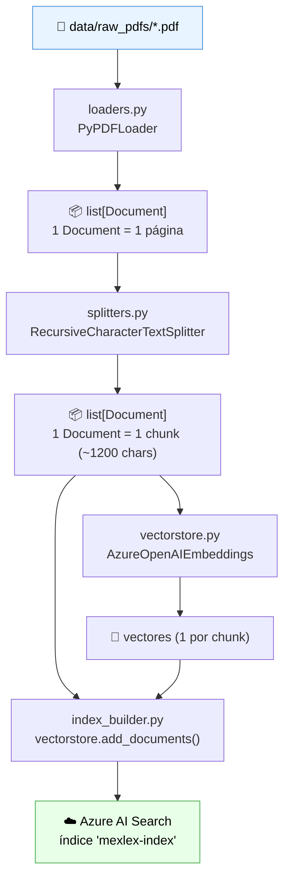
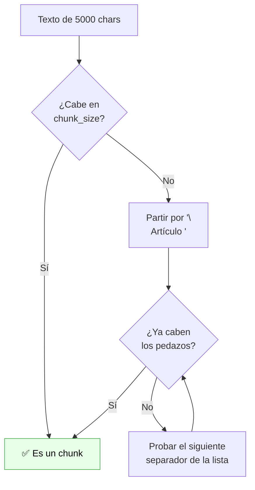
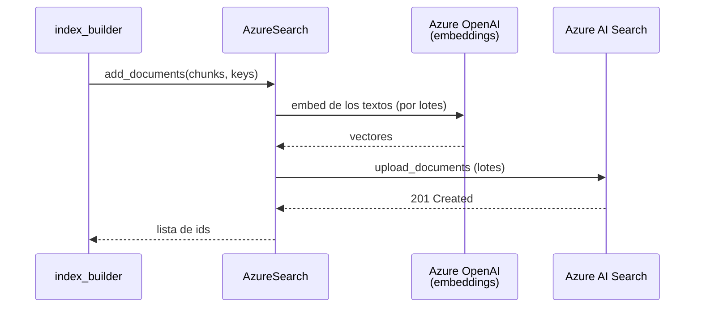

# Flujo de ingesta — `scripts/run_ingestion.py`

> **Qué logra este flujo:** convertir PDFs de leyes que están en tu disco en vectores buscables dentro de Azure AI Search.
> Es la mitad "offline" del RAG: se corre una vez por documento, no en cada pregunta.

---

## 1. El panorama general



En una frase: **cargar → partir → vectorizar → subir**.

---

## 2. Punto de entrada: el script

[`scripts/run_ingestion.py`](../scripts/run_ingestion.py)

```python
sys.path.insert(0, str(Path(__file__).resolve().parents[1] / "src"))

from mexlex.ingestion.index_builder import build_index

if __name__ == "__main__":
    n_chunks = build_index()
```

El script no tiene lógica: solo mete `src/` en el `sys.path` (para que `import mexlex` funcione sin instalar el paquete) y llama a `build_index()`. **Toda la lógica vive en `src/`**, y eso es a propósito: mañana la misma función la vas a poder llamar desde un test, desde un notebook o desde una Azure Function sin tocar nada.

---

## 3. La configuración: `config.py`

Antes de que corra cualquier cosa, se importa [`settings`](../src/mexlex/config.py). No es LangChain — es **pydantic-settings**, pero es el patrón que sostiene todo lo demás:

```python
class Settings(BaseSettings):
    model_config = SettingsConfigDict(env_file=".env", ...)
    azure_openai_endpoint: str = Field(..., alias="AZURE_OPENAI_ENDPOINT")
    ...
    chunk_size: int = 1200
    chunk_overlap: int = 200
```

Lo importante conceptualmente: `Field(...)` con puntos suspensivos significa **obligatorio**. Si te falta una variable en el `.env`, el error truena al importar el módulo, no a media ingesta con medio índice subido. Es un fail-fast deliberado.

Además `chunk_size` y `chunk_overlap` viven aquí y no hardcodeados en el splitter, para que puedas experimentar con distintos tamaños de chunk sin editar código.

---

## 4. Paso 1 — Cargar los PDFs (`loaders.py`)

### Lo que importamos de LangChain

| Importación | Paquete | Para qué |
|---|---|---|
| `PyPDFLoader` | `langchain_community.document_loaders` | Lee un PDF y lo convierte en `Document`s |
| `Document` | `langchain_core.documents` | El tipo de dato universal de LangChain (solo se usa para el type hint) |

### El concepto clave: `Document`

**Este es el objeto más importante de todo LangChain.** Prácticamente todo el framework consume o produce `Document`s. Tiene solo dos campos:

```python
Document(
    page_content="Artículo 1o. En los Estados Unidos Mexicanos...",  # el texto
    metadata={"source": "cpeum.pdf", "page": 0}                      # dict libre
)
```

`metadata` es un diccionario **completamente libre**: tú decides qué meterle. Lo que le pongas aquí es lo que vas a poder usar después para **citar la fuente** y para **filtrar búsquedas**. Es la razón por la que el loader hace esto:

```python
for doc in pdf_documents:
    doc.metadata["source"] = pdf_path.name   # "cpeum.pdf" en vez de "D:\\...\\cpeum.pdf"
```

Sin esa línea, `source` traería la ruta absoluta de tu máquina, que no le sirve de nada a un usuario final leyendo una cita.

### Qué produce

`PyPDFLoader.load()` regresa **un `Document` por página** del PDF. Un PDF de 200 páginas → 200 `Document`s. Todavía no hay nada de chunking aquí.

> 💡 **Punto de extensión:** este es el único módulo que cambiarías si tus PDFs fueran escaneados o tuvieran tablas complejas (ahí entraría Azure AI Document Intelligence). Como el resto del pipeline solo habla en `Document`s, nada más se entera del cambio. Eso es exactamente lo que te compra la abstracción.

---

## 5. Paso 2 — Partir en chunks (`splitters.py`)

### Lo que importamos de LangChain

| Importación | Paquete | Para qué |
|---|---|---|
| `RecursiveCharacterTextSplitter` | `langchain_text_splitters` | Parte textos largos respetando la estructura |

### ¿Por qué hay que partir el texto?

Tres razones, en orden de importancia:

1. **Precisión del retrieval.** Un vector representa el "significado promedio" de su texto. Si vectorizas una página entera con 5 artículos distintos, ese vector no se parece mucho a *ninguno* de los 5. Chunks más chicos = vectores más específicos = mejores resultados.
2. **Límite de contexto del LLM.** No le puedes mandar 200 páginas al modelo en cada pregunta.
3. **Costo.** Pagas por token enviado.

### Cómo funciona el splitter "recursivo"

El adjetivo *recursive* se refiere a que intenta una **lista de separadores en orden de prioridad**, cayendo al siguiente solo cuando el chunk todavía no cabe en `chunk_size`:

```python
LEGAL_SEPARATORS = [
    "\nArtículo ",    # 1º intento: cortar entre artículos  ← ideal
    "\nARTÍCULO ",
    "\nArt. ",
    "\nCAPÍTULO",     # 2º: entre capítulos
    "\nTÍTULO",
    "\n\n",           # 3º: entre párrafos
    "\n",             # 4º: entre líneas
    ". ",             # 5º: entre oraciones
    " ",              # 6º: entre palabras
    "",               # último recurso: a la mitad de una palabra
]
```



**Esta lista es el único trozo de este proyecto adaptado al dominio legal.** La lista default de LangChain es `["\n\n", "\n", " ", ""]`. Al anteponer `"\nArtículo "` le decimos: *si tienes que cortar, prefiere cortar justo donde empieza un artículo nuevo*. Así un chunk tiende a contener un artículo completo en lugar de la segunda mitad de uno y el principio del siguiente.

### `chunk_overlap`: por qué los chunks se traslapan

Con `chunk_size=1200, chunk_overlap=200`, los últimos 200 caracteres de un chunk se repiten al inicio del siguiente. Es un **seguro contra cortes desafortunados**: si una idea quedó partida justo en la frontera, el traslape hace que al menos uno de los dos chunks la contenga completa.

### El `chunk_id`: la key determinística

```python
counters: dict[str, int] = defaultdict(int)
for chunk in chunks:
    safe_source = _sanitize_key_part(str(source))   # "LFC.pdf" → "LFC_pdf"
    i = counters[safe_source]
    counters[safe_source] += 1
    chunk.metadata["chunk_id"] = f"{safe_source}-p{page}-{i}"
```

Esto **no es LangChain**, es una decisión de diseño nuestra, y tiene dos motivos:

- **Determinismo.** Si vuelves a correr la ingesta sobre el mismo PDF, cada chunk genera el mismo id → Azure Search **sobreescribe** en vez de duplicar. Sin esto, cada corrida metería copias nuevas con uuids random.
- **Caracteres válidos.** Azure AI Search solo acepta `letras, dígitos, _, - y =` en la key de un documento. Un `.` (como en `LFC.pdf`) hace fallar la subida entera con `InvalidName`. Por eso `_sanitize_key_part()` normaliza a ASCII y reemplaza todo lo demás por `_`.

> ⚠️ **Detalle sutil:** el contador es **por documento**, no global. Si fuera global, agregar un PDF nuevo que ordene alfabéticamente antes de uno ya indexado recorrería todos los ids siguientes, y la reingesta duplicaría los chunks en lugar de sobreescribirlos — justo lo contrario de lo que se buscaba.

Ojo: `metadata["source"]` **conserva el nombre original con el `.pdf`**. La sanitización aplica solo a la key. Las citas al usuario no se ven afectadas.

---

## 6. Paso 3 — Embeddings y vector store (`vectorstore.py`)

### Lo que importamos de LangChain

| Importación | Paquete | Para qué |
|---|---|---|
| `AzureOpenAIEmbeddings` | `langchain_openai` | Convierte texto → vector de floats |
| `AzureSearch` | `langchain_community.vectorstores` | Cliente del índice de Azure AI Search |

### Qué es un embedding

Un modelo de embeddings convierte un texto en una **lista de números** (p. ej. 3072 floats para `text-embedding-3-large`) que representa su significado. Textos con significado parecido quedan cerca en ese espacio vectorial. Eso es lo que permite buscar "¿qué dice sobre libertad de expresión?" y encontrar un artículo que nunca usa esas palabras exactas.

La interfaz `Embeddings` de LangChain tiene dos métodos, y la distinción importa:

- `embed_documents(textos)` → vectoriza **muchos** textos (se usa al indexar)
- `embed_query(texto)` → vectoriza **uno** (se usa al preguntar)

### `@lru_cache`: una sola conexión

```python
@lru_cache(maxsize=1)
def get_vectorstore() -> AzureSearch: ...
```

`lru_cache` de la stdlib hace que la primera llamada construya el objeto y las siguientes regresen **el mismo**. Sin esto, cada módulo que llame `get_vectorstore()` abriría su propio cliente HTTP contra Azure. Es un singleton perezoso barato.

### La magia (y el riesgo) de `AzureSearch`

```python
AzureSearch(
    azure_search_endpoint=...,
    azure_search_key=...,
    index_name=settings.azure_search_index_name,
    embedding_function=get_embeddings().embed_query,
    semantic_configuration_name=settings.azure_search_semantic_config_name,
)
```

**Al instanciar esta clase, si el índice no existe, LangChain lo crea automáticamente.** Llama una vez a `embed_query("Text")` para averiguar la dimensión del vector y con eso define el esquema. Por eso nunca tuviste que crear el índice a mano en el portal.

El esquema que crea tiene estos campos:

| Campo | Tipo | Contenido |
|---|---|---|
| `id` | key | El `chunk_id` que generamos |
| `content` | searchable text | El `page_content` del chunk (esto es lo que BM25 busca) |
| `content_vector` | vector | El embedding del chunk |
| `metadata` | string | El dict de metadata **serializado como JSON** |

> 💡 Que `metadata` se guarde como un JSON en un solo campo tiene una consecuencia práctica: **no puedes filtrar eficientemente por `source` o `page`** con esta configuración default. Cuando llegues a la Fase 5 y quieras filtros del tipo "solo búscame en la CPEUM", vas a tener que declarar campos propios con el parámetro `fields=` de `AzureSearch`.

---

## 7. Paso 4 — Orquestación (`index_builder.py`)

Aquí no hay lógica nueva; solo se encadenan los pasos anteriores:

```python
documents = load_pdfs(RAW_PDFS_DIR)                  # PDFs   → páginas
chunks = split_documents(documents, ...)             # páginas → chunks
vectorstore = get_vectorstore()                      # conecta (y crea índice si hace falta)
keys = [chunk.metadata["chunk_id"] for chunk in chunks]
vectorstore.add_documents(documents=chunks, keys=keys)
```

`add_documents()` es donde pasa todo lo pesado, y vale la pena saber qué hace por dentro:



Es decir: **una llamada a `add_documents` dispara N llamadas a la API de embeddings y M llamadas de subida a Azure Search**, todo por lotes. Ahí se va la mayor parte del tiempo (y del costo) de la ingesta.

---

## 8. Resumen: los conceptos de LangChain que ya practicaste

| Concepto | Clase concreta usada | Rol |
|---|---|---|
| **Document Loader** | `PyPDFLoader` | Fuente externa → `Document`s |
| **Document** | `langchain_core.documents.Document` | Unidad universal: texto + metadata |
| **Text Splitter** | `RecursiveCharacterTextSplitter` | `Document`s grandes → chunks |
| **Embeddings** | `AzureOpenAIEmbeddings` | Texto → vector |
| **Vector Store** | `AzureSearch` | Guarda y busca vectores |

Todos son **interfaces intercambiables**: cambiar `PyPDFLoader` por otro loader, o `AzureSearch` por Chroma/Pinecone, no obliga a reescribir el resto del pipeline. Ese es el valor real de LangChain aquí — no el código que te ahorra, sino las costuras que te deja.

---

## 9. Uso práctico

```bash
# 1. Pon tus PDFs en data/raw_pdfs/
# 2. Corre la ingesta
python scripts/run_ingestion.py
```

**Qué pasa cuando lo vuelves a correr:**

| Escenario | Resultado |
|---|---|
| Mismo PDF, sin cambios | Se sobreescriben los mismos chunks (mismas keys). No hay duplicados. |
| PDF nuevo agregado | Se suman sus chunks; los de los otros PDFs no se tocan. |
| PDF editado (más corto) | Se sobreescriben los chunks que coinciden, **pero los sobrantes de la versión anterior quedan huérfanos en el índice.** |
| PDF borrado del disco | Sus chunks **siguen en el índice**. La ingesta nunca borra. |

Los últimos dos casos son una limitación conocida del diseño actual: no hay borrado. Si necesitas limpiar, hoy la vía es borrar el índice desde el portal de Azure y reindexar.

---

## 10. Lo que este flujo **no** hace todavía

- No usa el LLM de chat (solo el de embeddings).
- No hay chains, ni LCEL, ni el operador `|` — eso arranca en el flujo de consulta.
- No extrae el número de artículo como metadata estructurada (Fase 5).
- No borra ni versiona documentos.

➡️ **Siguiente:** [02-flujo-consulta.md](./02-flujo-consulta.md) — cómo se usa este índice para responder preguntas.
