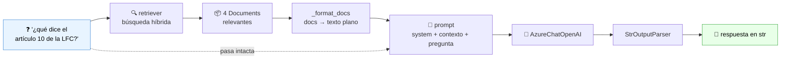
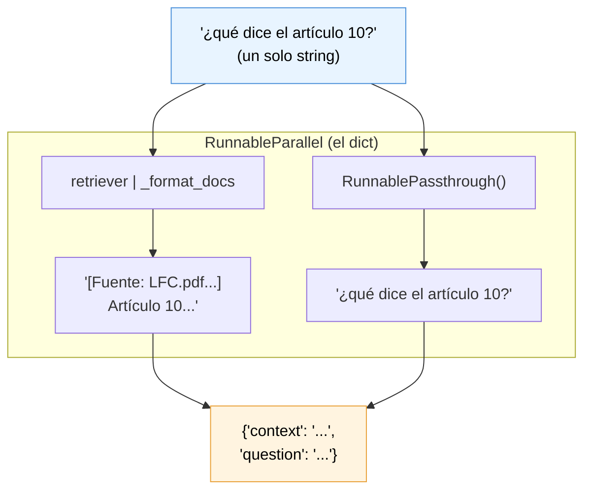
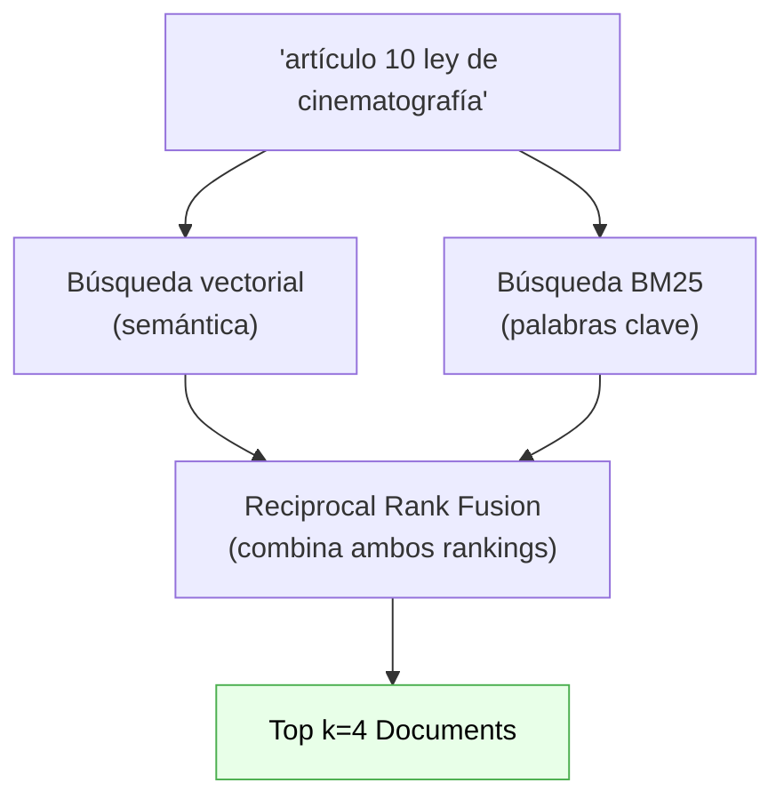
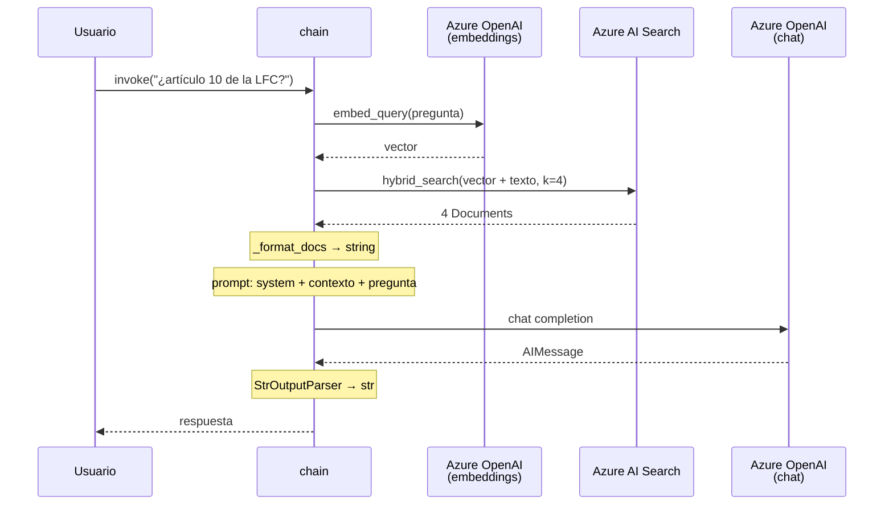

# Flujo de consulta — `scripts/query_test.py`

> **Qué logra este flujo:** tomar una pregunta en texto libre, buscar los fragmentos de ley relevantes en Azure AI Search, y pedirle al LLM que responda **usando solo esos fragmentos**.
> Es la mitad "online" del RAG: corre en cada pregunta.
> Aquí es donde por fin aparece **LCEL** (LangChain Expression Language), el corazón del framework.

Requisito: haber corrido antes la [ingesta](./01-flujo-ingesta.md).

---

## 1. El panorama general



El patrón RAG en una línea: **recuperar contexto relevante → inyectarlo en el prompt → dejar que el LLM redacte**.

---

## 2. Punto de entrada: el script

[`scripts/query_test.py`](../scripts/query_test.py)

```python
chain = build_simple_rag_chain()          # se arma UNA vez

while True:
    question = input("Tú: ").strip()
    respuesta = chain.invoke(question)     # se invoca N veces
    print(f"\nAsistente: {respuesta}\n")
```

Nota la separación: **armar la chain es caro** (abre clientes HTTP a Azure), **invocarla es barato**. Por eso se construye fuera del loop. Una chain de LangChain es un objeto reutilizable y sin estado — la puedes invocar mil veces.

> Este loop de terminal es literalmente lo único que se reemplaza en la Fase 2: Chainlit toma el mismo objeto `chain` y le pone una UI encima. La lógica no cambia.

---

## 3. El concepto central: `Runnable` y LCEL

Antes de leer la chain, hay que entender la abstracción sobre la que está construida.

**Casi todo en LangChain moderno implementa la interfaz `Runnable`.** Un `Runnable` es cualquier cosa que sabe recibir algo, transformarlo y regresarlo. Todos comparten los mismos métodos:

| Método | Qué hace |
|---|---|
| `.invoke(input)` | Ejecuta una vez y regresa el resultado |
| `.stream(input)` | Regresa un generador (token por token) ← esto usarás en Chainlit |
| `.batch([in1, in2])` | Ejecuta varias entradas en paralelo |
| `.ainvoke()` / `.astream()` | Versiones async |

Y como todos hablan el mismo idioma, se pueden **encadenar con el operador `|`**:

```python
chain = paso_a | paso_b | paso_c
```

Eso es **LCEL**. El `|` está sobrecargado (vía `__or__` en Python) y significa *"la salida de la izquierda es la entrada de la derecha"* — idéntico a un pipe de bash. El resultado de encadenar Runnables es **otro Runnable**, así que una chain se puede meter dentro de otra chain sin ceremonia.

Lo que te regala LCEL gratis, sin que escribas nada: streaming, ejecución async, paralelismo automático, reintentos, y trazas en LangSmith.

---

## 4. La chain, línea por línea

[`src/mexlex/chains/simple_rag_chain.py`](../src/mexlex/chains/simple_rag_chain.py)

```python
chain = (
    {"context": retriever | _format_docs, "question": RunnablePassthrough()}
    | prompt
    | llm
    | StrOutputParser()
)
```

Son cuatro eslabones. Vamos uno por uno.

### Lo que importamos de LangChain

| Importación | Paquete | Para qué |
|---|---|---|
| `ChatPromptTemplate` | `langchain_core.prompts` | Plantilla de mensajes con variables |
| `AzureChatOpenAI` | `langchain_openai` | El LLM de chat |
| `StrOutputParser` | `langchain_core.output_parsers` | `AIMessage` → `str` |
| `RunnablePassthrough` | `langchain_core.runnables` | Deja pasar la entrada sin cambios |
| `Document` | `langchain_core.documents` | Solo para el type hint de `_format_docs` |

---

### Eslabón 1 — El diccionario (la parte más confusa al principio)

```python
{"context": retriever | _format_docs, "question": RunnablePassthrough()}
```

**Un dict literal dentro de una chain LCEL no es un dict normal.** LangChain lo convierte automáticamente en un `RunnableParallel`: cada valor es un Runnable que recibe **la misma entrada** (aquí, el string de la pregunta), todos corren **en paralelo**, y el resultado es un dict con las mismas llaves y los valores ya resueltos.



Las dos ramas:

- **`retriever | _format_docs`** — una mini-chain: el retriever busca en Azure y regresa `list[Document]`; `_format_docs` los aplana a un solo string legible. Fíjate que `_format_docs` es **una función normal de Python**: LCEL la envuelve sola en un `RunnableLambda` al ver el `|`. No tienes que hacer nada especial para meter tu propio código en una chain.
- **`RunnablePassthrough()`** — la identidad: recibe la pregunta y regresa la pregunta. Existe porque el prompt necesita la pregunta original *además* del contexto, y sin esto se perdería (el dict consume la entrada).

**¿Por qué un dict?** Porque el siguiente eslabón, el prompt, tiene dos variables (`{context}` y `{question}`). Un `ChatPromptTemplate` espera recibir un dict con exactamente esas llaves.

### Eslabón 2 — El prompt

```python
prompt = ChatPromptTemplate.from_messages([
    ("system", SYSTEM_PROMPT),   # contiene el placeholder {context}
    ("human", "{question}"),
])
```

Recibe el dict y produce un **`ChatPromptValue`**: la lista de mensajes ya con las variables sustituidas, lista para mandarse a un modelo de chat.

El `SYSTEM_PROMPT` es donde vive el comportamiento del asistente, y sus tres reglas no son decorativas — son mitigaciones concretas:

1. *"basándote únicamente en el CONTEXTO"* + *"si no hay información suficiente, dilo"* → **reduce alucinaciones**. En dominio legal, inventar un artículo es el peor fallo posible.
2. *"menciona el artículo y la ley de origen"* → hace la respuesta **verificable** por el usuario.
3. *"esto no es asesoría legal"* → encuadre necesario del dominio.

Que el contexto vaya en el mensaje `system` y no en el `human` es deliberado: los modelos tratan el system prompt como instrucciones más estables, más difíciles de sobrescribir por lo que escriba el usuario.

### Eslabón 3 — El LLM

```python
AzureChatOpenAI(..., temperature=0)
```

Recibe el `ChatPromptValue` y regresa un **`AIMessage`** (que trae `.content` con el texto, más metadata de tokens).

`temperature=0` pide la salida más determinista posible. Para preguntas legales quieres reproducibilidad, no creatividad.

### Eslabón 4 — El parser

```python
StrOutputParser()
```

Extrae el `.content` del `AIMessage` y lo regresa como `str`. Parece trivial, y en cierto modo lo es — pero tenerlo como eslabón explícito significa que el día que quieras salida estructurada solo cambias esta pieza (`JsonOutputParser`, `PydanticOutputParser`) sin tocar el resto.

---

## 5. El flujo de tipos de dato

Esta tabla es probablemente lo más útil para tener en la cabeza. **En LCEL, depurar es casi siempre entender qué tipo entra y qué tipo sale de cada eslabón:**

| # | Eslabón | Entra | Sale |
|---|---|---|---|
| 0 | `chain.invoke(...)` | — | `str` (la pregunta) |
| 1a | `retriever` | `str` | `list[Document]` |
| 1b | `_format_docs` | `list[Document]` | `str` (contexto formateado) |
| 1c | `RunnablePassthrough()` | `str` | `str` (igual) |
| 1 | *el dict completo* | `str` | `dict` con `context` y `question` |
| 2 | `prompt` | `dict` | `ChatPromptValue` |
| 3 | `llm` | `ChatPromptValue` | `AIMessage` |
| 4 | `StrOutputParser()` | `AIMessage` | `str` |

Si una chain truena, casi siempre es porque un eslabón recibió un tipo distinto al que esperaba.

---

## 6. El retriever: la búsqueda híbrida

[`src/mexlex/retrieval/vectorstore.py`](../src/mexlex/retrieval/vectorstore.py)

```python
def get_retriever(k: int | None = None):
    search_type = "semantic_hybrid" if settings.azure_search_semantic_config_name else "hybrid"
    return get_vectorstore().as_retriever(
        search_type=search_type,
        k=k or settings.retrieval_k,
    )
```

`.as_retriever()` **convierte el vector store en un `Runnable`**. Un vector store por sí solo no es encadenable; un retriever sí. Esa es toda la diferencia entre los dos conceptos: el retriever es la cara "componible" del vector store.

### Qué significa "híbrido"



Las dos búsquedas se complementan justo donde la otra falla:

- **Vectorial** entiende sinónimos y paráfrasis ("libertad de prensa" ≈ "libertad de expresión"), pero es mala con términos exactos.
- **BM25** (keyword clásico) clava los términos literales — números de artículo, nombres propios, tecnicismos — pero no entiende sinónimos.

Para preguntas legales el híbrido es claramente mejor: una pregunta típica mezcla lenguaje natural ("¿qué dice sobre...?") con tokens exactos ("artículo 10").

Los tres modos disponibles:

| `search_type` | Qué hace | Requiere |
|---|---|---|
| `similarity` | Solo vectorial | Nada |
| `hybrid` | Vectorial + BM25 con RRF | Nada ← **el que usas hoy** |
| `semantic_hybrid` | Híbrido + reranker semántico de Azure | Semantic config + tier Basic+ |

Para activar `semantic_hybrid` basta con crear la semantic configuration en el portal de Azure y poner su nombre en `AZURE_SEARCH_SEMANTIC_CONFIG_NAME` en tu `.env`. El código ya está listo para cambiar solo.

### ⚠️ Una trampa específica de `AzureSearch`

`k` va como **parámetro de primer nivel**, no dentro de `search_kwargs`:

```python
# ✅ correcto para AzureSearch
.as_retriever(search_type="hybrid", k=4)

# ❌ truena: "got multiple values for keyword argument 'k'"
.as_retriever(search_type="hybrid", search_kwargs={"k": 4})
```

La segunda forma es la convención habitual en LangChain y funciona en casi todos los demás vector stores. Pero `AzureSearchVectorStoreRetriever` es la excepción: expone `k` como campo propio **y además** expande `search_kwargs` al llamar a la búsqueda, así que `k` llegaría dos veces. Vale la pena recordarlo porque casi todos los tutoriales de RAG que encuentres usan la forma que aquí falla.

---

## 7. `_format_docs`: de `Document`s a texto

```python
def _format_docs(docs: list[Document]) -> str:
    parts = []
    for doc in docs:
        source = doc.metadata.get("source", "desconocido")
        page = doc.metadata.get("page", "?")
        parts.append(f"[Fuente: {source}, página {page}]\n{doc.page_content}")
    return "\n\n---\n\n".join(parts)
```

Es una función de Python normal, pero hace un trabajo importante: **aquí es donde la metadata que guardaste en la ingesta se vuelve útil.** Al anteponer `[Fuente: LFC.pdf, página 3]` a cada chunk, el LLM tiene con qué construir la cita que le exige la regla 2 del system prompt.

Es un buen ejemplo de por qué vale la pena cuidar la metadata desde la ingesta: lo que no guardaste ahí, no lo puedes citar aquí.

---

## 8. Qué pasa realmente al escribir una pregunta



**Tres llamadas de red por pregunta:** embeddings, búsqueda, chat. Es el costo fijo de cualquier RAG.

---

## 9. Depurando la chain

Como cada Runnable es invocable por separado, puedes probar cualquier eslabón aislado:

```python
# ¿el retriever trae lo correcto?
from mexlex.retrieval.vectorstore import get_retriever
docs = get_retriever().invoke("artículo 10 ley federal de cinematografía")
for d in docs:
    print(d.metadata["source"], d.metadata.get("page"), d.page_content[:120])

# ¿cómo se ve el prompt final que recibe el LLM?
from mexlex.chains.simple_rag_chain import prompt
print(prompt.invoke({"context": "CONTEXTO DE PRUEBA", "question": "¿y esto?"}))
```

Regla práctica: **si la respuesta es mala, revisa primero el retriever.** La gran mayoría de fallos de RAG no son culpa del LLM, sino de que los chunks correctos nunca llegaron al contexto. Si en `docs` no está el artículo que buscas, ningún prompt lo va a arreglar.

Otras dos cosas útiles:

- **`retrieval_k` está en 4** (en `config.py`). Con varias leyes indexadas, 4 chunks se quedan cortos: es fácil que el artículo correcto no entre. Súbelo si ves que el retriever se queda corto.
- **El `ImportError: sys.meta_path is None` al salir del script es ruido conocido**, no un error tuyo: el `__del__` de `AzureSearch` en `langchain_community` toca el event loop de asyncio cuando Python ya se está apagando. Python mismo lo marca como *"Exception ignored"* y no afecta la respuesta.

---

## 10. Resumen: los conceptos de LangChain que ya practicaste

| Concepto | Clase concreta | Rol |
|---|---|---|
| **Runnable / LCEL** | el operador `\|` | Componer pasos |
| **RunnableParallel** | el dict literal | Ramas en paralelo |
| **RunnablePassthrough** | `RunnablePassthrough()` | Preservar la entrada original |
| **RunnableLambda** | `_format_docs` (implícito) | Meter funciones propias |
| **Retriever** | `AzureSearchVectorStoreRetriever` | Vector store → Runnable |
| **Prompt Template** | `ChatPromptTemplate` | Plantilla con variables |
| **Chat Model** | `AzureChatOpenAI` | El LLM |
| **Output Parser** | `StrOutputParser` | Normalizar la salida |

---

## 11. Hacia dónde crece esto

| Fase | Cambio | Qué se toca |
|---|---|---|
| **2 — Chainlit** | `.stream()` en vez de `.invoke()` | Nada de la chain; solo la UI |
| **3 — Memoria** | Historial ligado a `thread_id` | Se agrega un checkpointer |
| **4 — Agente** | El retriever se envuelve como `tool` | La chain fija se vuelve un grafo que **decide** |
| **5 — Búsqueda fina** | Semantic ranker, filtros por ley | `vectorstore.py` + campos del índice |

El salto conceptual grande es el de la Fase 4. Hoy la chain es **fija**: siempre busca, siempre responde, en ese orden. Un agente es un grafo donde el LLM decide *si* buscar, *dónde* buscar (tus PDFs o la web) y *cuántas veces* antes de responder.

---

⬅️ **Anterior:** [01-flujo-ingesta.md](./01-flujo-ingesta.md) — cómo se llenó el índice que este flujo consulta.
➡️ **Siguiente:** [03-fase2-chainlit-streaming.md](./03-fase2-chainlit-streaming.md) — esta misma chain, en el navegador y con streaming.
