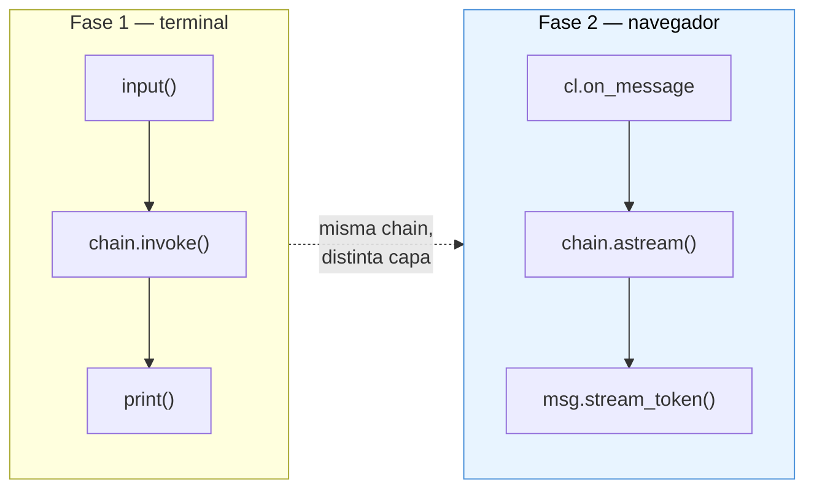
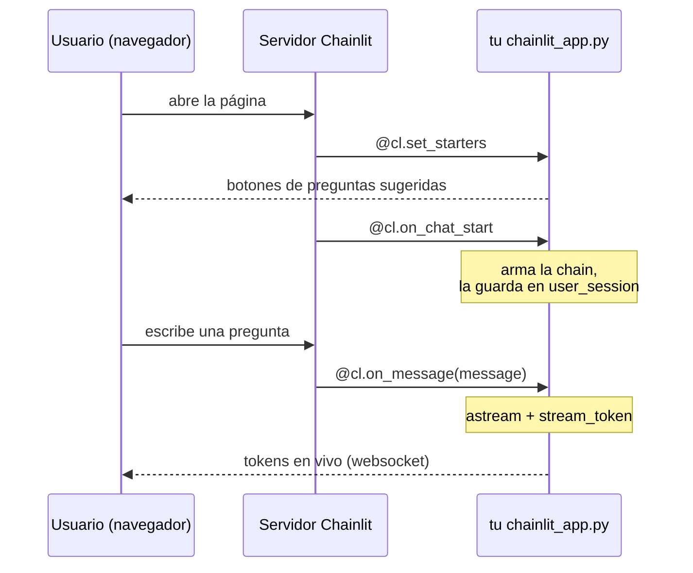
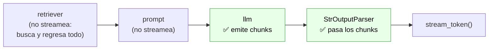
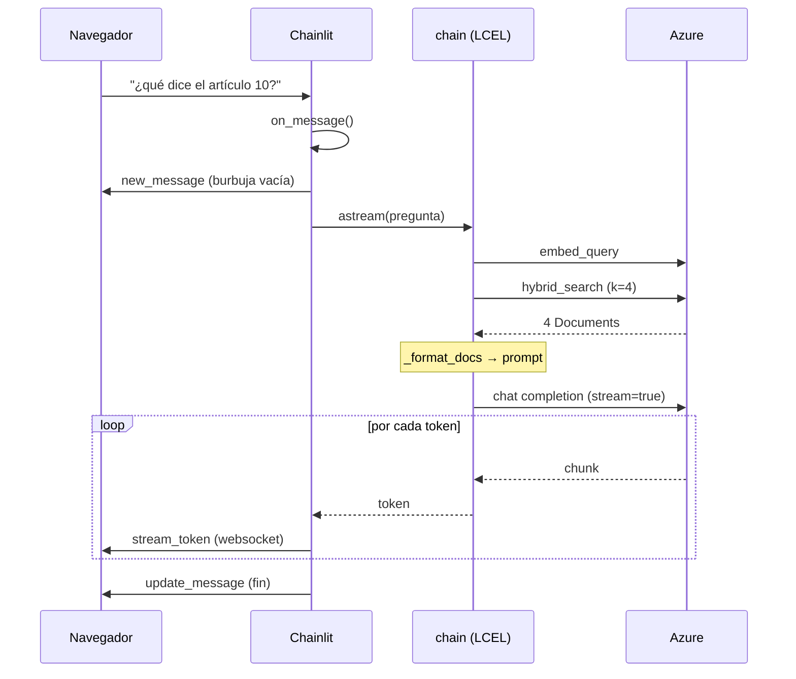

# Fase 2 — Chainlit con streaming

> **Qué cambia respecto a la Fase 1:** la misma chain, ahora en el navegador y respondiendo token por token.
> **Qué NO cambia:** absolutamente nada de la lógica de RAG. `src/` quedó intacto.
> **Qué sigue faltando:** memoria. Cada pregunta es independiente (eso es la Fase 3).

> 📌 **Nota:** este documento describe `app/chainlit_app.py` tal como quedó en la Fase 2.
> La Fase 3 modificó ese archivo para usar el grafo con memoria — los conceptos de
> Chainlit que se explican aquí siguen siendo válidos, pero el código actual difiere.
> Ver [04-fase3-memoria-conversacional.md](./04-fase3-memoria-conversacional.md).

---

## 1. El cambio en una imagen



Solo hay **tres diferencias reales**:

| | Fase 1 (`query_test.py`) | Fase 2 (`chainlit_app.py`) |
|---|---|---|
| Entrada | `input()` en la terminal | `@cl.on_message` |
| Ejecución | `.invoke()` — bloquea hasta terminar | `.astream()` — va soltando pedazos |
| Salida | `print()` al final | `stream_token()` conforme llega |

Que el cambio sea *tan* pequeño es el punto de haber puesto la lógica en `src/` y la interfaz fuera. La chain no sabe si la está invocando una terminal, un navegador o un test.

---

## 2. Archivos nuevos

```
app/chainlit_app.py    ← la app (único archivo con código nuevo)
chainlit.md            ← pantalla de bienvenida (markdown puro)
.chainlit/             ← config que Chainlit genera solo la primera vez
```

Nada dentro de `src/` fue modificado en esta fase.

---

## 3. Cómo se corre

```bash
chainlit run app/chainlit_app.py -w
```

Se abre en http://localhost:8000. El flag `-w` (*watch*) recarga la app al guardar el archivo — cómodo mientras experimentas.

Ojo: `chainlit run` **no** es `python app/chainlit_app.py`. Chainlit importa tu archivo, registra las funciones que decoraste y levanta un servidor web propio (FastAPI + websockets por debajo). Tu archivo nunca se ejecuta como script suelto.

---

## 4. El modelo mental de Chainlit: decoradores + ciclo de vida

Chainlit funciona registrando **callbacks del ciclo de vida** de un chat. Tú no escribes el loop; escribes qué pasa en cada evento:



Los tres decoradores que usamos:

| Decorador | Cuándo corre | Qué hacemos ahí |
|---|---|---|
| `@cl.set_starters` | Al cargar la pantalla inicial | Devolver preguntas sugeridas |
| `@cl.on_chat_start` | Una vez por sesión (pestaña) | Armar la chain y guardarla |
| `@cl.on_message` | En cada mensaje del usuario | Ejecutar la chain y streamear |

**Todos son `async`.** Chainlit corre sobre asyncio: un solo proceso atiende a varios usuarios concurrentes mientras esperan respuesta de Azure. Por eso el flujo entero de esta fase es asíncrono.

---

## 5. `on_chat_start`: la chain y `user_session`

```python
@cl.on_chat_start
async def on_chat_start() -> None:
    chain = build_simple_rag_chain()
    cl.user_session.set("chain", chain)
```

`cl.user_session` es un **diccionario aislado por sesión**: cada pestaña del navegador tiene el suyo. Chainlit se encarga de darte el correcto según qué websocket mandó el mensaje.

Hoy la chain **no tiene estado**, así que técnicamente podríamos tenerla en una variable global y ahorrarnos esto. La guardamos en la sesión por dos razones:

1. Es el patrón idiomático de Chainlit y el que vas a encontrar en la documentación oficial.
2. **Es exactamente el lugar donde va a vivir el historial en la Fase 3.** Cuando agregues memoria, la conversación de cada usuario tiene que estar separada — y `user_session` ya te da ese aislamiento gratis.

Sobre el costo: `build_simple_rag_chain()` llama a `get_vectorstore()`, que está envuelto en `@lru_cache`. La primera sesión paga la conexión a Azure; las siguientes reutilizan el mismo cliente.

---

## 6. `on_message`: el corazón de la fase

```python
@cl.on_message
async def on_message(message: cl.Message) -> None:
    chain = cl.user_session.get("chain")

    answer = cl.Message(content="")
    await answer.send()                      # 1. crear la burbuja vacía

    async for token in chain.astream(message.content):
        await answer.stream_token(token)     # 2. llenarla token por token

    await answer.update()                    # 3. cerrar el stream
```

Los tres pasos, y por qué importan:

1. **`cl.Message(content="")` + `send()`** — crea la burbuja en la UI *antes* de tener contenido. Si no la envías primero, no hay dónde meter los tokens.
2. **`stream_token(token)`** — appendea a la burbuja existente. Cada llamada viaja por websocket al navegador.
3. **`update()`** — marca el mensaje como terminado (apaga el cursor de "escribiendo" y persiste el contenido final).

### `.astream()` vs `.invoke()`

Aquí es donde LCEL te cobra los intereses de haber armado la chain como Runnables. **No tuviste que configurar nada para tener streaming**: `astream()` ya venía en la interfaz.

Funciona porque los eslabones de la chain saben propagar el stream:



Detalle importante para entender lo que ves en pantalla: **hay una pausa de ~1-2 segundos antes del primer token**. No es lentitud del modelo — es el retrieval. El retriever tiene que terminar completo (embeber la pregunta + consultar Azure Search) antes de que el LLM pueda empezar a generar. Solo la parte del LLM en adelante es incremental.

Si el último eslabón fuera, digamos, un parser de JSON que necesita el documento completo para validarlo, el streaming se perdería. `StrOutputParser` es *transparente al stream*: por eso funciona.

### El manejo de errores

```python
    try:
        async for token in chain.astream(message.content):
            await answer.stream_token(token)
    except Exception as exc:
        answer.content = f"⚠️ Ocurrió un error...\n```\n{type(exc).__name__}: {exc}\n```"
        await answer.update()
        raise
```

Sin este `try`, un fallo de Azure (rate limit, credencial vencida, índice borrado) deja **la burbuja vacía en la UI** y el stack trace solo aparece en la terminal donde corriste `chainlit run`. Como usuario no tendrías idea de qué pasó.

El `raise` al final es deliberado: mostramos el error al usuario *y además* dejamos que se propague, para que quede en los logs del servidor y en LangSmith cuando lo conectes en la Fase 6.

---

## 7. `set_starters`: preguntas sugeridas

```python
@cl.set_starters
async def starters() -> list[cl.Starter]:
    return [
        cl.Starter(label="Artículo 4 constitucional",
                   message="¿Qué derechos garantiza el artículo 4 de la CPEUM?"),
        ...
    ]
```

Botones en la pantalla inicial. `label` es lo que se ve; `message` es lo que se envía al hacer clic (llega a `on_message` como si el usuario lo hubiera escrito).

Más allá de lo cosmético, resuelven el problema de la **página en blanco**: un usuario que abre el chat no sabe qué puede preguntar ni qué documentos indexaste. Ajusta los starters al corpus que tengas realmente en `data/raw_pdfs/`, o van a apuntar a leyes que no están indexadas y el asistente va a responder "no tengo esa información".

---

## 8. `chainlit.md`: la pantalla de bienvenida

Markdown puro que Chainlit muestra al abrir la app. Ahí pusimos el **disclaimer legal** que el plan original recomendaba: dejar claro que el asistente no sustituye asesoría profesional y que puede no reflejar reformas recientes.

Es un archivo, no código: edítalo libremente. Si lo dejas vacío, Chainlit no muestra pantalla de bienvenida.

---

## 9. Qué pasa en cada pregunta (flujo completo)



Verificado contra la app real: una consulta produce **1 `stream_start` + 130 `stream_token` + 1 `update_message`**.

---

## 10. Conceptos nuevos de esta fase

| Concepto | Dónde | Para qué |
|---|---|---|
| `@cl.on_chat_start` | Chainlit | Inicializar la sesión |
| `@cl.on_message` | Chainlit | Manejar cada mensaje |
| `@cl.set_starters` | Chainlit | Preguntas sugeridas |
| `cl.user_session` | Chainlit | Estado aislado por usuario ← **clave para la Fase 3** |
| `cl.Message` + `stream_token` | Chainlit | Burbuja que se llena en vivo |
| **`.astream()`** | **LangChain** | **Ejecución asíncrona con streaming** |

De LangChain, lo único nuevo es `astream()`. Todo lo demás es Chainlit. Eso está bien: esta fase es de interfaz, no de framework.

---

## 11. Depuración

**Los errores aparecen en la terminal donde corriste `chainlit run`**, no en el navegador (salvo el mensaje amigable que agregamos). Ten esa terminal a la vista.

Problemas típicos y qué significan:

| Síntoma | Causa probable |
|---|---|
| `ModuleNotFoundError: mexlex` | Corriste desde otra carpeta. Debe ser la raíz del proyecto. |
| La burbuja se queda vacía y no pasa nada | Credenciales de Azure. Revisa la terminal. |
| Responde "no tengo información" a todo | El índice está vacío: corre `python scripts/run_ingestion.py`. |
| Tarda mucho antes del primer token | Normal: es el retrieval. Ver sección 6. |
| Los cambios no se reflejan | Te faltó el flag `-w`. |

Para aislar si un problema es de la UI o de la chain, corre `python scripts/query_test.py`: usa exactamente la misma chain sin Chainlit de por medio. Si ahí también falla, el problema no está en esta fase.

---

## 12. Lo que sigue

| Fase | Qué agrega | Dónde se toca |
|---|---|---|
| **3 — Memoria** | El asistente recuerda el turno anterior | `user_session` + checkpointer |
| **4 — Agente** | Decide entre buscar en PDFs o en la web | La chain fija se vuelve un grafo |
| **5 — Citas y filtros** | Mostrar fuentes en la UI (`cl.Element`) | `vectorstore.py` + la app |

El límite más visible hoy: **si preguntas "¿y qué dice el siguiente artículo?", no tiene idea de a qué te refieres.** Cada `on_message` arranca de cero. Eso es justo lo que arregla la Fase 3.

---

⬅️ **Anterior:** [02-flujo-consulta.md](./02-flujo-consulta.md) — la chain que esta UI envuelve.
➡️ **Siguiente:** [04-fase3-memoria-conversacional.md](./04-fase3-memoria-conversacional.md) — darle memoria con LangGraph.
