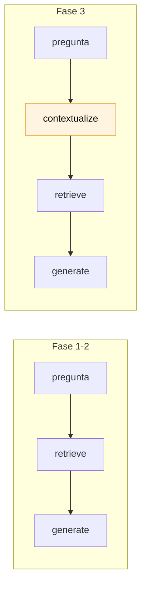
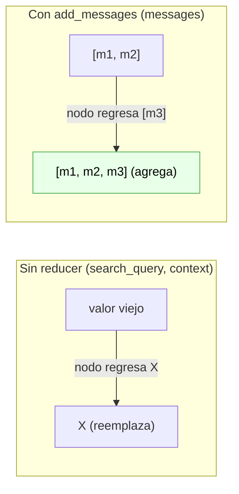
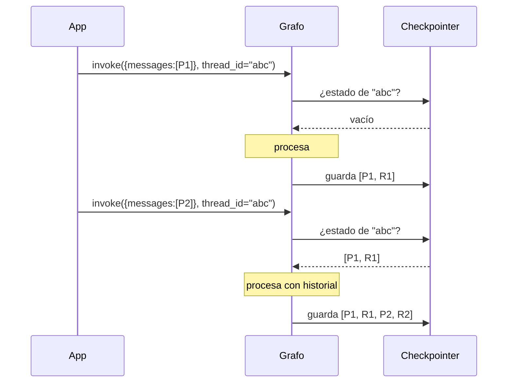

# Fase 3 — Memoria conversacional (LangGraph + checkpointer)

> **El problema que resuelve:** en la Fase 2, preguntar *"¿y el siguiente artículo?"* no funcionaba. Cada mensaje arrancaba de cero.
> **Cómo se resuelve:** la chain LCEL se convierte en un **grafo de LangGraph** con un **checkpointer** que persiste el historial por `thread_id`.
> **El detalle que casi todos pasan por alto:** con RAG no basta con recordar. También hay que **reescribir la pregunta** antes de buscar.

> 📌 **Nota:** la Fase 4 reemplazó este grafo por un agente en `app/chainlit_app.py`, y el
> nodo `contextualize` que se explica aquí dejó de ser necesario (el agente reformula solo).
> El código de esta fase sigue vivo en `chains/conversational_rag.py` y `scripts/chat_test.py`,
> justamente para poder comparar los dos enfoques.
> Ver [05-fase4-agente-tools.md](./05-fase4-agente-tools.md).

---

## 1. Por qué la memoria sola no alcanza en un RAG

Este es el concepto central de la fase, así que vale la pena verlo antes que el código.

Supón que ya tienes historial y el usuario escribe *"¿y el siguiente artículo?"*. Si mandas eso tal cual al retriever:

```
retriever.invoke("¿y el siguiente artículo?")
   → busca en Azure Search chunks parecidos a "siguiente artículo"
   → recupera cualquier cosa: basura
```

El LLM vería el historial (bien) pero con un contexto recuperado inútil (mal). Respondería mal o inventaría.

La solución estándar es un paso previo de **contextualización**: usar el LLM para convertir la pregunta dependiente del historial en una **pregunta autónoma**, y *esa* es la que se manda al retriever.

```
Historial: "¿Qué dice el artículo 10 de la Ley Federal de Cinematografía?"
Usuario:   "¿y el siguiente artículo?"
              ↓ contextualize
Consulta:  "¿Qué dice el artículo 11 de la Ley Federal de Cinematografía?"
              ↓ retrieve
           chunks correctos ✅
```

Por eso el flujo gana **dos** pasos respecto a la Fase 1, no uno:



---

## 2. Archivos nuevos y modificados

| Archivo | Estado | Qué es |
|---|---|---|
| `src/mexlex/agent/memory.py` | 🆕 | El checkpointer (`MemorySaver`) |
| `src/mexlex/chains/conversational_rag.py` | 🆕 | El grafo: contextualize → retrieve → generate |
| `src/mexlex/retrieval/formatting.py` | 🆕 | `format_docs` extraído para compartir |
| `scripts/chat_test.py` | 🆕 | Probar la memoria en terminal |
| `tests/test_memory.py` | 🆕 | Tests del recorte de historial (sin Azure) |
| `app/chainlit_app.py` | ✏️ | Usa el grafo + `thread_id` |
| `src/mexlex/chains/simple_rag_chain.py` | ✏️ | Importa `format_docs` en vez de definirlo |
| `src/mexlex/config.py` | ✏️ | Nuevo setting `memory_max_messages` |

> Nota sobre el refactor: `_format_docs` estaba dentro de `simple_rag_chain.py`, pero el grafo nuevo necesita exactamente el mismo formato. En vez de duplicarlo, se movió a `retrieval/formatting.py`. **La chain de la Fase 1 sigue funcionando igual** (`query_test.py` no cambió).

---

## 3. De chain a grafo: por qué el cambio

La Fase 1 usaba LCEL: una tubería fija de Runnables. LangGraph es otra abstracción, para otra cosa:

| | LCEL (`chain = a \| b \| c`) | LangGraph (`StateGraph`) |
|---|---|---|
| Forma | Tubería lineal | Grafo de nodos y aristas |
| Estado | Fluye, no se guarda | **Objeto de estado compartido** |
| Memoria | No trae | **Checkpointer integrado** |
| Ciclos / decisiones | No | Sí (aristas condicionales) |

Para esta fase, la razón concreta es la tercera fila: **el checkpointer es una funcionalidad del grafo**, no de LCEL. Podríamos haber usado `RunnableWithMessageHistory` (la ruta LCEL), pero LangGraph es el camino que recomienda LangChain hoy y, sobre todo, es lo que la Fase 4 necesita: cuando el agente tenga que *decidir* entre buscar en los PDFs o en la web, ese "decidir" es una arista condicional, algo que LCEL no expresa.

Hoy el grafo es lineal y no decide nada. Está bien: en esta fase LangGraph entra solo por la memoria.

---

## 4. El estado: `RagState`

```python
class RagState(TypedDict):
    messages: Annotated[list[AnyMessage], add_messages]
    search_query: str
    context: str
```

En LangGraph, **los nodos no se pasan argumentos entre sí**: todos leen y escriben un objeto de estado compartido. Cada nodo recibe el estado y regresa un dict con los campos que quiere actualizar.

La parte más importante es `Annotated[..., add_messages]`. Ese segundo elemento es un **reducer**: le dice a LangGraph *cómo* combinar el valor nuevo con el que ya había.



Es decir: cuando el nodo `generate` regresa `{"messages": [respuesta]}`, LangGraph **appendea** en vez de sobrescribir. Sin ese reducer, cada turno borraría la conversación — no habría memoria por más checkpointer que pusieras.

`search_query` y `context` no llevan reducer a propósito: son datos del turno actual, y en el siguiente se recalculan.

---

## 5. El checkpointer (`agent/memory.py`)

```python
@lru_cache(maxsize=1)
def get_checkpointer() -> MemorySaver:
    return MemorySaver()
```

Un checkpointer guarda el estado del grafo después de cada paso, indexado por `thread_id`. Eso convierte un grafo sin estado en uno con memoria:



Fíjate en la consecuencia práctica: **desde la app solo mandas el mensaje nuevo**, no la conversación entera. LangGraph rehidrata el resto.

Dos decisiones de diseño aquí:

- **`@lru_cache` (singleton).** Si cada sesión creara su propio `MemorySaver`, cada una escribiría en un dict distinto y no habría nada que recuperar. **El aislamiento entre usuarios lo da el `thread_id`, no tener checkpointers separados.**
- **`MemorySaver` es un dict en memoria del proceso.** El historial **se pierde al reiniciar el servidor** y no se comparte entre procesos. Para producción se cambia por `langgraph-checkpoint-postgres` o `-sqlite`: solo se toca esta función, el grafo no se entera.

---

## 6. Los tres nodos

### `contextualize` — reescribe la pregunta

```python
async def contextualize(state: RagState) -> dict:
    messages = state["messages"]
    ultima = messages[-1].content

    if len(messages) == 1:          # primer turno: no hay nada que resolver
        return {"search_query": ultima}

    chain = contextualize_prompt | get_llm()
    respuesta = await chain.ainvoke({"messages": _trim(messages)})
    return {"search_query": respuesta.content}
```

El atajo del primer turno no es cosmético: **ahorra una llamada completa al LLM** (con su latencia y su costo) en el caso más común, que es la primera pregunta de cada conversación.

El prompt le dice explícitamente al modelo que **no responda**, solo reescriba, e incluye un ejemplo. Sin esa instrucción los modelos tienden a contestar la pregunta en vez de reformularla.

**Costo de la fase:** a partir del segundo turno hay **2 llamadas al LLM por pregunta** en vez de 1. Es el precio de que el retrieval funcione con preguntas de seguimiento.

### `retrieve` — igual que antes, pero con la consulta corregida

```python
async def retrieve(state: RagState) -> dict:
    docs = await get_retriever().ainvoke(state["search_query"])
    return {"context": format_docs(docs)}
```

Lo único que cambió respecto a la Fase 1: busca con `search_query` (la reescrita), no con lo que escribió el usuario.

### `generate` — redacta con contexto + historial

```python
async def generate(state: RagState) -> dict:
    chain = generate_prompt | get_llm()
    respuesta = None
    async for chunk in chain.astream(
        {"context": state["context"], "messages": _trim(state["messages"])}
    ):
        respuesta = chunk if respuesta is None else respuesta + chunk
    return {"messages": [respuesta]}
```

Dos cosas que valen la pena:

- **`MessagesPlaceholder`** en el prompt es lo que permite inyectar una lista de mensajes (el historial) dentro de una plantilla. Reutilizamos el `SYSTEM_PROMPT` de la Fase 1 sin cambios: las reglas de citar y no inventar siguen aplicando.
- **Se usa `astream` y se acumulan los chunks** (`respuesta + chunk` — los `AIMessageChunk` se suman entre sí). Así los tokens salen del nodo conforme se generan, que es lo que la UI consume. Con `ainvoke` el nodo devolvería todo de golpe y perderías el streaming.

---

## 7. El recorte del historial (`_trim`)

```python
trim_messages(
    messages,
    max_tokens=settings.memory_max_messages,   # 10
    strategy="last",
    token_counter=len,
    start_on="human",
    include_system=False,
)
```

Sin recorte, una conversación larga acabaría mandando decenas de mensajes al LLM en cada turno: más costo, más latencia y eventualmente error por exceder el contexto.

| Parámetro | Qué hace |
|---|---|
| `token_counter=len` | Cuenta **mensajes**, no tokens. Menos preciso, mucho más fácil de razonar. |
| `strategy="last"` | Conserva los más recientes (lo relevante en un chat). |
| `start_on="human"` | Evita que el historial empiece con una respuesta del asistente colgando sin su pregunta. |
| `include_system=False` | El system prompt se agrega aparte, no se cuenta ni se recorta. |

Se ajusta con `memory_max_messages` en `config.py`. Los tests en `tests/test_memory.py` cubren este comportamiento y **no necesitan Azure**.

---

## 8. El grafo compilado

```python
builder = StateGraph(RagState)
builder.add_node("contextualize", contextualize)
builder.add_node("retrieve", retrieve)
builder.add_node("generate", generate)

builder.add_edge(START, "contextualize")
builder.add_edge("contextualize", "retrieve")
builder.add_edge("retrieve", "generate")
builder.add_edge("generate", END)

return builder.compile(checkpointer=get_checkpointer())
```

`START` y `END` son nodos virtuales que marcan entrada y salida. `compile()` valida el grafo y devuelve un objeto **que también es un Runnable**: tiene `.invoke()`, `.astream()`, etc., igual que la chain de la Fase 1. Por eso la app cambió tan poco.

---

## 9. La UI: `thread_id` por sesión

```python
@cl.on_chat_start
async def on_chat_start():
    graph = build_conversational_rag_graph()
    cl.user_session.set("graph", graph)
    cl.user_session.set("thread_id", cl.user_session.get("id"))
```

Aquí se cobra lo que anticipamos en la Fase 2: `user_session` ya nos daba aislamiento por pestaña. Usamos el id de sesión de Chainlit como `thread_id`, así cada pestaña es una conversación independiente.

```python
@cl.on_message
async def on_message(message: cl.Message):
    config = {"configurable": {"thread_id": cl.user_session.get("thread_id")}}

    async for chunk, metadata in graph.astream(
        {"messages": [HumanMessage(content=message.content)]},
        config=config,
        stream_mode="messages",
    ):
        if metadata.get("langgraph_node") == "generate" and chunk.content:
            await answer.stream_token(chunk.content)
```

Tres diferencias respecto a la Fase 2:

1. **`config` con `thread_id`** — sin esto, LangGraph no sabe qué conversación recuperar (y con un checkpointer configurado, lanza error).
2. **Se manda solo el mensaje nuevo** — el historial lo pone el checkpointer.
3. **`stream_mode="messages"` + filtro por nodo** — ver abajo.

### ⚠️ El filtro por nodo no es opcional

`stream_mode="messages"` emite tokens de **cualquier** llamada al LLM dentro del grafo. Como `contextualize` también llama al modelo, sin el filtro el usuario vería aparecer la pregunta reformulada ("¿Qué dice el artículo 11...?") y *después* la respuesta. Se ve como un bug.

El `metadata` que acompaña a cada chunk trae `langgraph_node`, y con eso nos quedamos solo con lo que produce `generate`.

Los modos de streaming de LangGraph, para ubicarte:

| `stream_mode` | Qué emite |
|---|---|
| `"values"` | El estado completo después de cada nodo |
| `"updates"` | Solo lo que cambió cada nodo |
| `"messages"` | **Tokens del LLM** ← el que necesitamos para la UI |

---

## 10. Verificación

Probado end-to-end contra Azure, en terminal y a través de la UI:

```
Tú: ¿Qué dice el artículo 10 de la Ley Federal de Cinematografía?
Asistente: El Artículo 10, Ley Federal de Cinematografía establece que quienes
           produzcan películas... [104 chunks]

Tú: ¿y el siguiente artículo?
Asistente: El Artículo 11, Ley Federal de Cinematografía dice que toda persona
           podrá participar... [182 chunks]
```

Inspeccionando el estado persistido:

```python
estado = graph.get_state(config)
# Mensajes guardados en el thread: 4
# search_query del último turno: "¿Qué dice el artículo 11 de la Ley Federal de Cinematografía?"
```

Eso último es la prueba de que `contextualize` hizo su trabajo: el usuario escribió *"¿y el siguiente artículo?"* y al retriever le llegó la pregunta completa. Un `thread_id` distinto devuelve 0 mensajes, confirmando el aislamiento.

`graph.get_state(config)` es, por cierto, tu mejor herramienta de depuración en esta fase: te deja ver exactamente qué recuerda el grafo.

---

## 11. Conceptos nuevos

| Concepto | Dónde | Para qué |
|---|---|---|
| `StateGraph` | LangGraph | Definir el flujo como nodos + aristas |
| Estado + reducers (`add_messages`) | LangGraph | Compartir y acumular datos entre nodos |
| **Checkpointer** (`MemorySaver`) | LangGraph | **Persistir el historial** |
| **`thread_id`** | LangGraph | **Identificar cada conversación** |
| `stream_mode="messages"` | LangGraph | Streamear tokens desde dentro del grafo |
| `MessagesPlaceholder` | LangChain | Inyectar historial en un prompt |
| `trim_messages` | LangChain | Acotar el historial |
| Contextualización de la consulta | Patrón de RAG | Que el retrieval funcione con seguimientos |

---

## 12. Limitaciones actuales

| Limitación | Impacto | Cuándo se resuelve |
|---|---|---|
| `MemorySaver` es en memoria | El historial se pierde al reiniciar el servidor | Cambiar a Postgres/SQLite |
| 2 llamadas al LLM por turno | Más costo y latencia desde el 2º mensaje | Inherente al patrón |
| El grafo siempre busca | Un "gracias" dispara una búsqueda innecesaria | **Fase 4** (el agente decide) |
| Recorte por número de mensajes | Aproximado; un mensaje largo pesa igual que uno corto | Cambiar `token_counter` |
| Sin resumen de lo recortado | Lo que sale de la ventana se olvida del todo | Fase 6 (opcional) |

La tercera es la más interesante y es justo la puerta de entrada a la Fase 4: hoy el grafo es un flujo fijo que **siempre** busca. Un agente decide *si* buscar, *dónde* (tus PDFs o la web) y *cuántas veces* antes de responder.

---

⬅️ **Anterior:** [03-fase2-chainlit-streaming.md](./03-fase2-chainlit-streaming.md) — la UI que aquí ganó memoria.
➡️ **Siguiente:** [05-fase4-agente-tools.md](./05-fase4-agente-tools.md) — convertirlo en un agente que decide.
