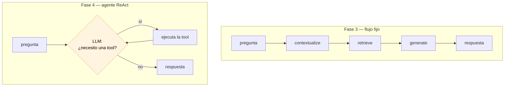
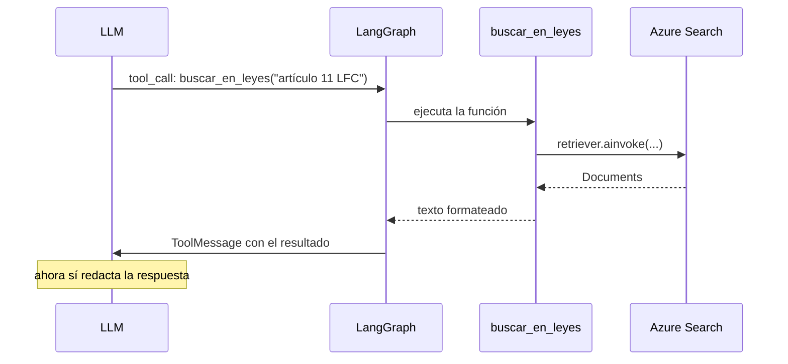
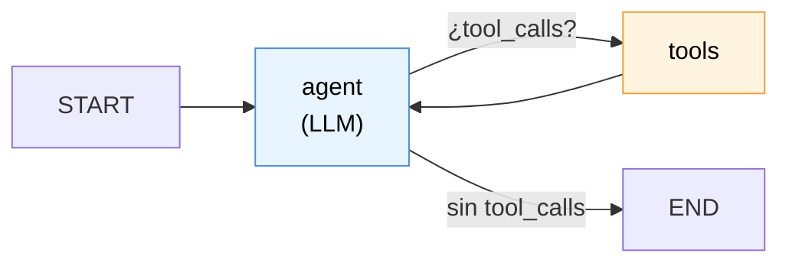

# Fase 4 — Agente ReAct con tools

> **El cambio conceptual:** hasta la Fase 3, *tú* decidías el flujo y el código lo ejecutaba siempre igual. Ahora **el LLM decide**: si buscar, con qué consulta, en qué fuente y cuántas veces.
> **Lo que se gana:** un "gracias" ya no dispara una búsqueda; una pregunta fuera del corpus puede salir a la web.
> **Lo que se paga:** menos determinismo. El mismo input puede tomar caminos distintos.

---

## 1. Flujo fijo vs. agente



Ese ciclo es el patrón **ReAct** (*Reasoning + Acting*): el modelo alterna entre razonar y actuar hasta que decide que ya puede responder. La flecha que regresa es toda la diferencia — es lo que le permite buscar, mirar el resultado y decidir buscar otra vez.

| | Fase 3 | Fase 4 |
|---|---|---|
| ¿Quién decide? | El código | **El LLM** |
| Búsquedas por pregunta | Exactamente 1 | 0, 1 o N |
| Fuentes | Solo el corpus | Corpus **y/o** web |
| Reformular seguimientos | Nodo `contextualize` | **El agente solo** |
| Predecible | Sí | No del todo |

---

## 2. Archivos nuevos y modificados

| Archivo | Estado | Qué es |
|---|---|---|
| `src/mexlex/tools/legal_search_tool.py` | 🆕 | El retriever como tool |
| `src/mexlex/tools/web_search_tool.py` | 🆕 | Tavily como tool (opcional) |
| `src/mexlex/agent/prompts.py` | 🆕 | System prompt del agente |
| `src/mexlex/agent/graph.py` | 🆕 | `create_react_agent` + tools + checkpointer |
| `scripts/agent_test.py` | 🆕 | Terminal, mostrando las tools que usa |
| `tests/test_agent.py` | 🆕 | Contrato de las tools (sin Azure) |
| `app/chainlit_app.py` | ✏️ | Usa el agente + muestra `cl.Step` por tool |
| `src/mexlex/config.py` | ✏️ | `tavily_api_key`, `web_search_max_results` |
| `.env.example` | ✏️ | `TAVILY_API_KEY` |

**`conversational_rag.py` (Fase 3) no se borró.** Sigue funcionando y `scripts/chat_test.py` lo usa: es útil para comparar los dos enfoques lado a lado.

---

## 3. Qué es una tool, en realidad

Una tool es **una función de Python + una descripción en lenguaje natural**. El decorador `@tool` toma la firma y el docstring y genera un schema JSON que se le manda al modelo:

```python
@tool
async def buscar_en_leyes(consulta: str) -> str:
    """Busca en el corpus de leyes mexicanas indexadas..."""
    docs = await get_retriever().ainvoke(consulta)
    return format_docs(docs)
```

De ahí sale, más o menos:

```json
{
  "name": "buscar_en_leyes",
  "description": "Busca en el corpus de leyes mexicanas indexadas...",
  "parameters": {"consulta": {"type": "string"}}
}
```

El modelo nunca ve tu código: **solo ve ese JSON**. Cuando decide usarla, no la ejecuta — devuelve un mensaje que dice *"quiero llamar a `buscar_en_leyes` con `consulta='artículo 11 de la LFC'`"*. LangGraph intercepta eso, ejecuta la función de verdad, y le devuelve el resultado al modelo.



### ⚠️ El docstring es prompt, no documentación

Este es **el punto más importante de la fase**. El docstring de una tool no es para ti: es el texto con el que el modelo decide si esa tool le sirve. Un docstring vago produce un agente que elige mal, y el síntoma (respuestas raras) no apunta nada obvio hacia el docstring.

Compara:

```python
"""Busca documentos."""                       # ❌ ¿qué documentos? ¿cuándo?
```
```python
"""Busca en el corpus de leyes mexicanas indexadas (Constitución y
leyes federales en PDF).

Úsala SIEMPRE que la pregunta sea sobre el contenido de una ley...

La consulta debe ser autónoma y específica: incluye el número de
artículo y el nombre de la ley cuando se conozcan. Por ejemplo,
"artículo 11 de la Ley Federal de Cinematografía" en vez de
"el siguiente artículo".

Si el resultado viene vacío... ese documento no está en el corpus.
"""                                            # ✅
```

El segundo le dice tres cosas que el modelo necesita: **cuándo** usarla, **cómo** redactar el argumento, y **cómo interpretar** un resultado vacío. Los tests en `tests/test_agent.py` verifican justamente este contrato.

---

## 4. La tool de búsqueda web (opcional)

```python
def get_web_search_tool() -> TavilySearch | None:
    if not settings.tavily_api_key:
        return None          # el agente se arma sin ella
    return TavilySearch(
        max_results=settings.web_search_max_results,
        include_domains=["diputados.gob.mx", "dof.gob.mx", "scjn.gob.mx", "gob.mx"],
        description=WEB_TOOL_DESCRIPTION,
    )
```

Tres decisiones:

- **Devuelve `None` en vez de lanzar error.** Así el proyecto corre completo sin obligarte a dar de alta otra cuenta. `get_tools()` simplemente no la agrega, y el system prompt ya contempla ambos escenarios.
- **`include_domains` con fuentes oficiales.** Sin este filtro, una búsqueda legal trae blogs de despachos que reinterpretan la ley. Acotarlo a `diputados.gob.mx`, `dof.gob.mx` y `scjn.gob.mx` mejora bastante la señal.
- **`description` personalizada.** La descripción default de Tavily es genérica ("busca en internet"). La sobreescribimos para decirle al modelo que es **de respaldo**, no la primera opción, y que avise cuando la use.

> Para habilitarla: consigue una key gratuita en [tavily.com](https://tavily.com) y ponla en el `.env` como `TAVILY_API_KEY`.

---

## 5. El system prompt es la política de decisión

En `agent/prompts.py`. Aquí el prompt deja de ser un detalle de estilo: es donde defines **cuándo usar cada tool y en qué orden**. Vas a iterarlo mucho más que el código.

Las reglas que le pusimos:

1. Para contenido de una ley → primero `buscar_en_leyes`.
2. **Redacta consultas autónomas** (resuelve "¿y el siguiente?" antes de buscar).
3. Si la primera búsqueda falla, reformula una vez más antes de rendirte.
4. Si el corpus no la tiene y hay web → úsala **y avisa** que no viene del corpus oficial.
5. Si no hay web y el corpus no la tiene → dilo. **No inventes.**
6. No todo requiere tool: un saludo se responde directo.

La regla 6 es la que hace que "gracias" no dispare una búsqueda. La regla 2 es la que reemplaza al nodo `contextualize` de la Fase 3.

---

## 6. El agente: `create_react_agent`

```python
return create_react_agent(
    model=get_llm(),
    tools=get_tools(),
    prompt=AGENT_SYSTEM_PROMPT,
    checkpointer=get_checkpointer(),
)
```

Cuatro líneas para todo el ciclo ReAct. Por dentro construye un grafo con:

- un nodo **`agent`** → llama al LLM con las tools disponibles;
- un nodo **`tools`** → ejecuta las tools que el LLM pidió;
- una **arista condicional**: si el último mensaje trae `tool_calls`, va a `tools`; si no, termina;
- una arista de `tools` de regreso a `agent` (el ciclo).



Escribirlo a mano con `StateGraph` serían ~40 líneas; nada mágico, solo repetitivo. Vale la pena saber que esos nodos se llaman `agent` y `tools` porque **los vas a necesitar para filtrar el streaming**.

**El checkpointer es el mismo de la Fase 3**: la memoria se hereda sin cambios. `get_checkpointer()` sigue siendo el mismo singleton y el `thread_id` sigue separando conversaciones.

---

## 7. El nodo `contextualize` desapareció (y está bien)

En la Fase 3 hacía falta un paso explícito para convertir "¿y el siguiente artículo?" en una consulta autónoma. **El agente lo hace solo**, porque ve el historial y es él quien redacta el argumento de la tool. Verificado:

```
Tú: ¿Qué dice el artículo 10 de la Ley Federal de Cinematografía?
  [TOOL] buscar_en_leyes({'consulta': 'artículo 10 de la Ley Federal de Cinematografía'})

Tú: ¿y el siguiente artículo?
  [TOOL] buscar_en_leyes({'consulta': 'artículo 11 de la Ley Federal de Cinematografía'})
```

El usuario escribió tres palabras y el agente buscó la pregunta completa, resolviendo tanto el "siguiente" como la ley implícita.

**Bonus de costo:** la Fase 3 gastaba 2 llamadas al LLM en *todos* los turnos con historial (contextualizar + responder). El agente gasta 2 solo cuando decide buscar; en un "gracias" gasta 1.

---

## 8. La UI: mostrar lo que el agente decide

El agente puede tardar varios segundos buscando. Sin feedback, el usuario ve una burbuja vacía y no sabe si está trabajando o si se colgó. Por eso la app ahora muestra un `cl.Step` por cada tool:

```python
async for modo, dato in agent.astream(..., stream_mode=["updates", "messages"]):
    if modo == "updates":
        for nodo, salida in dato.items():
            for msg in salida.get("messages", []) or []:
                for tool_call in getattr(msg, "tool_calls", []) or []:
                    paso = cl.Step(name=tool_call["name"], type="tool")
                    paso.input = tool_call["args"]
                    await paso.send()
                    pasos[tool_call["id"]] = paso

                if nodo == "tools":
                    paso = pasos.get(getattr(msg, "tool_call_id", ""))
                    if paso is not None:
                        paso.output = str(msg.content)[:TOOL_OUTPUT_PREVIEW]
                        await paso.update()

    elif modo == "messages":
        chunk, metadata = dato
        if metadata.get("langgraph_node") == "agent" and chunk.content:
            ...stream_token
```

Tres detalles que importan:

- **Dos `stream_mode` a la vez.** `"updates"` te dice qué produjo cada nodo (de ahí salen las tool calls); `"messages"` te da los tokens. Pedir ambos hace que `astream` devuelva tuplas `(modo, dato)`.
- **Los Steps se casan por `tool_call_id`.** La llamada y el resultado llegan en eventos distintos; el id es lo que los une. Con dos tools en paralelo, sin eso mezclarías resultados.
- **La burbuja de respuesta se crea hasta el primer token**, no al inicio. Si la creas antes, los Steps aparecen *debajo* de la respuesta, que se lee al revés.

El filtro `langgraph_node == "agent"` sigue siendo necesario, por la misma razón que en la Fase 3: aquí el nodo se llama `agent` en vez de `generate`.

---

## 9. Verificación

Probado contra Azure, en terminal y por la UI. Cuatro escenarios:

| Pregunta | Tools usadas | Resultado |
|---|---|---|
| "¿Qué dice el artículo 10 de la LFC?" | `buscar_en_leyes` × 1 | Texto correcto del artículo 10 |
| "¿y el siguiente artículo?" | `buscar_en_leyes("artículo 11 de la LFC")` | Correcto: **reformuló solo** |
| "gracias, muy claro" | **ninguna** | Respuesta corta y directa |
| "artículo 123 de la Ley Federal del Trabajo" | `buscar_en_leyes` × 1 | Admitió no tenerlo. **No inventó** |

El tercer caso es la mejora más visible sobre la Fase 3, donde un "gracias" disparaba embedding + búsqueda en Azure. El cuarto confirma que la regla de no alucinar sobrevive al cambio a agente.

La tool de Tavily se verificó hasta donde se puede sin key: construye bien, se registra como segunda tool y aplica su descripción. **La llamada real a la API no está probada** porque no hay `TAVILY_API_KEY` en el `.env`.

---

## 10. Conceptos nuevos

| Concepto | Dónde | Para qué |
|---|---|---|
| `@tool` | LangChain | Función + docstring → tool invocable |
| Tool calling | LLM | El modelo pide ejecutar una función |
| `ToolMessage` / `tool_call_id` | LangChain | Casar cada resultado con su llamada |
| **Patrón ReAct** | LangGraph | Ciclo razonar ⇄ actuar |
| `create_react_agent` | LangGraph | El agente ya armado |
| `stream_mode=["updates","messages"]` | LangGraph | Ver decisiones **y** tokens |
| `cl.Step` | Chainlit | Mostrar pasos intermedios en la UI |

---

## 11. Limitaciones y cosas a vigilar

| Tema | Detalle |
|---|---|
| **No determinismo** | La misma pregunta puede tomar caminos distintos. Debuggear es más difícil que con un flujo fijo. |
| **Sin tope de iteraciones** | En teoría el agente podría entrar en un ciclo de búsquedas. `create_react_agent` acepta límites de recursión si lo ves pasar. |
| **Depende del modelo** | Un modelo chico elige tools peor. Si ves decisiones raras, prueba con uno más capaz antes de reescribir el prompt. |
| **El prompt es frágil** | Cambiar una regla puede alterar el comportamiento en otras. Vale la pena probar los 4 escenarios de arriba tras cada edición. |
| **Web sin verificar** | Falta `TAVILY_API_KEY` para probar esa ruta de punta a punta. |
| **Citas sin enlace** | El agente cita ley y artículo, pero la UI no muestra los fragmentos como fuentes formales. Eso es Fase 5. |

**Herramienta de depuración:** `python scripts/agent_test.py` imprime cada tool call con sus argumentos. Cuando el agente responda algo raro, míralo ahí primero: casi siempre el problema es la consulta con la que llamó a la tool, no la redacción de la respuesta.

---

## 12. Lo que sigue

| Fase | Qué agrega |
|---|---|
| **5** | Semantic ranking, metadata por ley/artículo para filtrar, y mostrar las fuentes citadas en la UI |
| **6** | LangSmith para ver cada decisión del agente, evaluación y pulido |

LangSmith se vuelve bastante más útil ahora que en las fases anteriores: con un flujo fijo la traza era predecible; con un agente, poder ver *por qué* eligió una tool es justo lo que necesitas cuando algo sale raro.

---

⬅️ **Anterior:** [04-fase3-memoria-conversacional.md](./04-fase3-memoria-conversacional.md) — la memoria que este agente hereda.
➡️ **Siguiente:** [06-fase5-retrieval-estructurado.md](./06-fase5-retrieval-estructurado.md) — darle precisión con lookup exacto por artículo.
