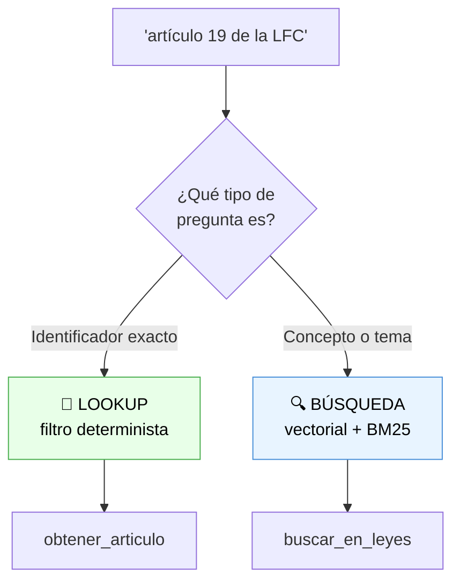
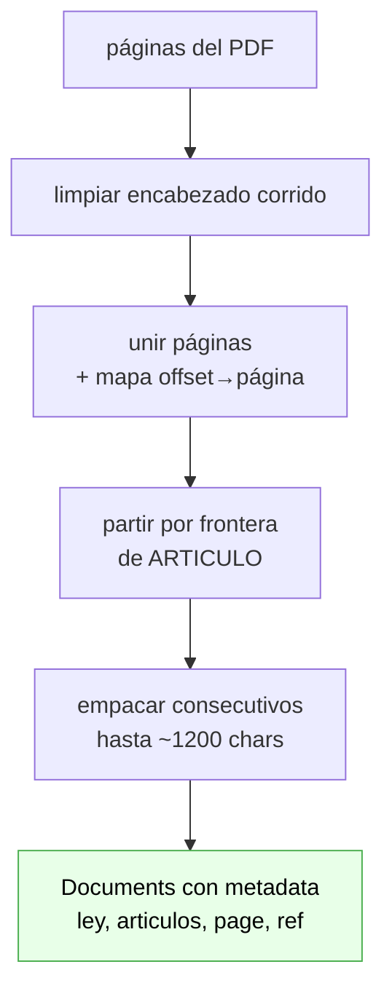

# Fase 5 — Retrieval estructurado por artículo

> **El problema:** pedirle "de qué habla el artículo 19" devolvía el artículo equivocado, aunque el agente generara la consulta correcta.
> **La causa:** buscar un artículo por número es un problema de *lookup*, no de *similitud*.
> **La solución:** metadata estructurada + filtro exacto. La búsqueda vectorial se queda para lo que sí sabe hacer.

---

## 1. Por qué fallaba (y por qué subir `k` no lo arreglaba)

Dos escenarios que se comportan al revés de lo que uno esperaría:

| Pregunta | Antes | Por qué |
|---|---|---|
| "¿de qué habla el artículo 19?" | ❌ traía otro artículo | Lookup disfrazado de búsqueda |
| "¿qué artículo habla de precios por exhibición pública?" | ✅ funcionaba bien | Búsqueda semántica de verdad |

**Para los embeddings**, "artículo 19" y "artículo 18" son vectores casi idénticos: el número es un token minúsculo dentro de un chunk de 1200 caracteres y apenas mueve la representación. El modelo entiende *"esto habla de un artículo"*, no *"esto habla del 19"*.

**Para BM25**, la palabra "artículo" aparece en prácticamente todos los chunks — su IDF es ≈ 0, así que no discrimina nada. Y el token "19" compite con fechas, fracciones, numerales y referencias cruzadas ("...conforme al artículo 19...").

Súmale que el PDF trae ruido de extracción: el artículo 19 real dice `"el diez por ciento del tiem po total"` — con "tiempo" partido a la mitad. Eso degrada aún más el matching por keyword.

**Por eso subir `k` no ayudaba:** el problema no era traer pocos resultados, sino que el ranking nunca tuvo señal para ordenarlos. Pedir 20 en vez de 4 solo trae 16 chunks irrelevantes más.



### Sobre el semantic ranker

**Sí funciona en el tier gratuito F0**, bajo el plan de facturación *Free* (cuota mensual de consultas). Lo que exige Basic+ es el plan *Standard* de pago por uso. Es una confusión común: el *tier del servicio* y el *plan del ranker* son cosas distintas.

Pero **no resuelve este problema**, y vale la pena entender por qué. La documentación de Microsoft es explícita:

> *"Lo que el semantic ranker no puede hacer es volver a correr la consulta sobre todo el corpus. Reordena el conjunto de resultados existente, los 50 mejores según el algoritmo de ranking base."*

Es decir: es un **re**ranker. Si el chunk del artículo 19 no entró en esos 50, ningún reordenamiento lo rescata. Ayuda en las preguntas temáticas — el escenario que ya funcionaba.

---

## 2. Archivos nuevos y modificados

| Archivo | Estado | Qué es |
|---|---|---|
| `src/mexlex/ingestion/structure.py` | 🆕 | Parser de estructura legal |
| `src/mexlex/retrieval/schema.py` | 🆕 | Esquema explícito del índice |
| `src/mexlex/retrieval/lookup.py` | 🆕 | Consultas por filtro OData |
| `src/mexlex/tools/article_tool.py` | 🆕 | `obtener_articulo`, `expandir_contexto` |
| `tests/test_structure.py`, `test_lookup.py` | 🆕 | 20 tests nuevos, sin Azure |
| `src/mexlex/ingestion/splitters.py` | ✏️ | Reescrito sobre `structure.py` |
| `src/mexlex/retrieval/vectorstore.py` | ✏️ | Pasa `fields=` al crear el índice |
| `src/mexlex/retrieval/formatting.py` | ✏️ | Citas con ley/artículo + `artifact` |
| `src/mexlex/tools/legal_search_tool.py` | ✏️ | Ahora es explícitamente "por tema" |
| `src/mexlex/agent/prompts.py` | ✏️ | Política de elección de tool |
| `app/chainlit_app.py` | ✏️ | Panel de fuentes |

---

## 3. Chunking consciente de la estructura

El cambio de fondo. Antes, `PyPDFLoader` entregaba un `Document` por página y el splitter cortaba cada página por tamaño, a ciegas.

### El encabezado corrido

Primer hallazgo al mirar el texto real: **cada página del PDF empieza con 9 líneas idénticas** (~200 caracteres):

```
LEY FEDERAL DE CINEMATOGRAFÍA
CÁMARA DE DIPUTADOS DEL H. CONGRESO DE LA UNIÓN
Secretaría General
Secretaría de Servicios Parlamentarios
Última Reforma DOF 22-03-2021
10 de 31
```

Eso hacía dos daños: metía ruido en cada chunk (diluyendo el embedding) y, peor, **se colaba a media frase** cuando un artículo cruzaba de página. `limpiar_paginas()` lo detecta de forma genérica — líneas que aparecen en ≥60% de las páginas dentro de su zona superior — y lo quita. De paso, ese mismo análisis da gratis el nombre de la ley.

### El pipeline



Unir las páginas antes de cortar es lo que permite que un artículo a caballo entre dos páginas quede completo en un chunk. El mapa de offsets conserva de qué página venía cada fragmento, para poder citarla.

### La regla de empaquetado

Se empacan artículos consecutivos hasta llenar `chunk_size`, **sin partir ninguno**. Un chunk típico queda así:

```
chunk LFC#12  →  articulos: [19, 20]
    ARTICULO 19.- Los exhibidores reservarán el diez por ciento...
    ARTICULO 20.- Los precios por la exhibición pública serán fijados...
```

Es un punto medio deliberado. Un chunk por artículo daría un mapeo 1:1 perfecto, pero muchos artículos son de una sola frase y los chunks diminutos empeoran la búsqueda semántica — justo el escenario que ya funcionaba. Empacar mantiene contexto suficiente para los embeddings sin perder la trazabilidad, porque `articulos` guarda todos los que cubre.

Solo se parte un artículo cuando él solo excede `chunk_size`; en ese caso todas sus partes conservan el mismo número y el lookup las devuelve juntas y en orden.

### El regex, y una lección sobre validar contra datos reales

Los encabezados parecían simples hasta mirar el documento completo. En una **misma ley** conviven:

```
ARTICULO 1o.-      ARTICULO 4 o.-      ARTICULO 11. -
ARTICULO 10.-      ARTICULO 47.        Artículo 1.
```

La primera versión del regex exigía guion final. Con eso, los artículos 43 al 58 (que usan `ARTICULO 47.`, sin guion, porque los introdujeron reformas posteriores) **no se detectaban**, y su texto se absorbía silenciosamente dentro del tramo del artículo 42. Lo peor: la verificación superficial se veía sana — "artículos 1 al 42, sin huecos" — porque los faltantes no dejaban hueco, simplemente no existían.

El regex final se apoya en dos condiciones que lo hacen específico:

1. **Dígitos justo después de `ARTICULO`** → descarta las notas de reforma (`Artículo adicionado DOF 05-01-1999`), que aparecen por decenas.
2. **Puntuación justo después del número** (`.` `-` `:`) → descarta las referencias cruzadas (`...se refiere el artículo 24 de la presente Ley`, `...el artículo 41, fracción I`), donde al número le sigue una palabra o una coma.

Un fallo parecido tuvo `TRANSITORIOS`: el salto de línea del PDF dejaba la palabra "Transitorio" iniciando renglón a media prosa (`"...\nTransitorio se destinarán en términos de la Ley de Ingresos..."`) y cortaba el documento en lugares absurdos. Se arregló exigiendo que el encabezado **ocupe su propia línea**.

Los dos casos están congelados como tests en `tests/test_structure.py`.

---

## 4. El esquema del índice

Hasta la Fase 4 dejábamos que `AzureSearch` creara el índice solo. Ese esquema default guarda toda la metadata **serializada como JSON en un único campo `metadata`, que no es filtrable**: sirve para leerla después de recuperar un documento, pero no para buscar por ella.

Declarando los campos a mano (`retrieval/schema.py`):

| Campo | Tipo | Para qué |
|---|---|---|
| `ley` / `ley_id` | String, filterable | "Ley Federal de Cinematografía" / "LFC" |
| `articulos` | **Collection(Int32)**, filterable | Los artículos del chunk: `[19, 20]` |
| `articulo_inicio` | Int32, sortable | Orden y etiqueta |
| `chunk_index` | Int32, sortable | Posición en la ley → vecinos |
| `page`, `source`, `seccion`, `ref` | filterable | Citas y filtros |

Que `articulos` sea una **colección** es lo que hace que un chunk con los artículos 19 y 20 responda a la consulta de cualquiera de los dos.

El mecanismo funciona sin parchear nada: `AzureSearch.add_embeddings` escribe en un campo declarado cualquier llave de `metadata` que coincida con su nombre. Basta con que el splitter la ponga en el `Document`.

### ⚠️ Dos trampas del índice

**El esquema solo se aplica al CREAR el índice.** `langchain_community` solo lo define en el `except ResourceNotFoundError`; apuntar a un índice existente con campos nuevos no lo migra, y las escrituras fallan o pierden los campos. Por eso esta fase usa un índice nuevo (`mexlex-index-v2`) en lugar de modificar el anterior. El tier F0 permite 3 índices, así que el viejo queda como rollback.

**La configuración semántica también se crea con el índice.** Por eso se separó en dos ajustes:

- `AZURE_SEARCH_SEMANTIC_CONFIG_NAME` — se bakea siempre al crear el índice.
- `AZURE_SEARCH_USE_SEMANTIC_RANKER` — si el retriever la usa (default `false`).

Si fueran una sola variable, activar el ranker más adelante obligaría a reindexar todo otra vez.

---

## 5. El lookup determinista

`retrieval/lookup.py` no usa vectores ni el semantic ranker. Consulta el `SearchClient` con `search_text="*"` y un filtro OData:

```python
def filtro_por_articulo(numero: int, ley_id: str | None = None) -> str:
    filtro = f"articulos/any(a: a eq {int(numero)})"
    if ley_id:
        filtro = f"{filtro} and ley_id eq '{escapar_odata(ley_id)}'"
    return filtro
```

Tres detalles:

- **`any(...)`** porque `articulos` es una colección.
- **`int(numero)`** fuerza el tipo: blindaje contra interpolar texto arbitrario en el filtro (hay un test que lo verifica).
- **`escapar_odata`** duplica las comillas simples, que es como OData las escapa.

Al no pasar término de búsqueda, la consulta no gasta embeddings ni cuota de semantic ranker. Es exacta y barata.

---

## 6. Las tools nuevas

Ahora el agente tiene tres tools sobre el corpus, y **la descripción de cada una es la que decide si elige bien**:

| Tool | Cuándo | Cómo funciona |
|---|---|---|
| `obtener_articulo(numero, ley)` | La pregunta menciona un artículo por número | Filtro exacto |
| `buscar_en_leyes(consulta)` | Pregunta temática, no se sabe el artículo | Híbrida (vector + BM25) |
| `expandir_contexto(ref, direccion)` | Un fragmento quedó cortado | Filtro por rango |

El desvío explícito en el docstring de `buscar_en_leyes` es clave:

> *⚠️ Si el usuario menciona un artículo POR NÚMERO, usa `obtener_articulo` en vez de esta: la búsqueda por similitud no distingue bien entre números de artículo.*

Sin esa línea el agente sigue yendo a la búsqueda temática por costumbre. Hay un test que verifica que la mención siga ahí.

### Ambigüedad entre leyes

`ley` es opcional a propósito. Si el usuario dice solo "dime el artículo 19" con dos leyes indexadas, el agente llama sin filtro, recibe los dos, y el prompt le pide **presentarlos y preguntar** en vez de adivinar:

```
Tu: dime el articulo 19
  [TOOL] obtener_articulo({'numero': 19})
  → Artículo 19, Ley Federal de Cinematografía: ...
  → Artículo 19, Ley Federal de Protección de Datos...
  "Si quieres, te puedo dar el artículo 19 de una ley específica."
```

### `content_and_artifact`: fuentes sin gastar tokens

Las tres tools se declaran así:

```python
@tool(response_format="content_and_artifact")
async def obtener_articulo(numero: int, ley: str = "") -> tuple[str, list[dict]]:
    ...
    return texto_para_el_llm, lista_de_fuentes
```

El primer elemento va al modelo; el segundo queda en `ToolMessage.artifact`, que **el LLM no ve**. Es el canal ideal para la UI: datos estructurados de cada fuente (ley, artículos, página, texto) sin inflar el prompt ni obligar a parsear el texto con regex del otro lado.

---

## 7. Citas y panel de fuentes

La cita pasó de `[Fuente: LFC.pdf, página 9]` a:

```
[LEY FEDERAL DE CINEMATOGRAFÍA · arts. 19-20 · p. 3 · ref LFC#12]
```

La `ref` es para el agente (se la pasa a `expandir_contexto`); el usuario ve solo la parte legible, y el system prompt le prohíbe explícitamente citar el nombre del PDF o la ref.

En la UI, `app/chainlit_app.py` acumula los `artifact` de las tools, deduplica por `ref` y los cuelga del mensaje como elementos `cl.Text(display="side")`:

```
El Artículo 19 de la Ley Federal de Cinematografía habla de...

---
**Fuentes consultadas**
- LEY FEDERAL DE CINEMATOGRAFÍA · arts. 19-20 · p. 3    ← clicable
```

Detalle de Chainlit: un elemento `display="side"` se abre en el panel lateral **al hacer clic sobre su nombre en el texto del mensaje**. Por eso hay que listar los nombres al final; si solo se adjuntan los elementos, no hay dónde hacer clic.

---

## 8. Verificación

**Sin Azure** — 43 tests (`python -m pytest tests/ -q`), incluidos los formatos reales de encabezado, el no-partir-artículos y la construcción de filtros.

**Contra Azure**, con dos leyes indexadas (170 chunks):

| Pregunta | Tool elegida | Resultado |
|---|---|---|
| "de qué habla el artículo 19 de la LFC" | `obtener_articulo(19, 'LFC')` | ✅ Texto correcto |
| "¿y el siguiente artículo?" | `obtener_articulo(20, 'LFC')` | ✅ Resolvió el número solo |
| "qué artículo habla de precios por exhibición pública" | `buscar_en_leyes` | ✅ Encontró el 20 (sin degradarse) |
| "dime el artículo 19" (sin ley) | `obtener_articulo(19)` | ✅ Mostró ambas leyes y preguntó |
| "artículo 999 de la LFC" | `obtener_articulo(999, 'LFC')` | ✅ Dijo que no existe, no inventó |
| "gracias" | ninguna | ✅ 0 tools |

Cobertura del parser sobre `LFC.pdf`: **58 artículos, sin huecos** (antes se detectaban 42, con los demás absorbidos silenciosamente).

---

## 9. Conceptos nuevos

| Concepto | Para qué |
|---|---|
| Lookup vs. búsqueda semántica | Elegir la herramienta según el tipo de pregunta |
| Chunking consciente de la estructura | Que las fronteras del chunk sigan al documento |
| Esquema explícito de índice | Campos filtrables en vez de un JSON opaco |
| Filtros OData (`any`, rangos) | Consultas exactas sobre metadata |
| `response_format="content_and_artifact"` | Datos para la UI sin gastar tokens del LLM |
| `cl.Text(display="side")` | Panel de fuentes verificable |
| Reranker vs. retriever | Por qué el semantic ranker no arregla el lookup |

---

## 10. Limitaciones

- **El parser depende del formato del PDF.** Está validado contra dos leyes de la Cámara de Diputados; otra convención puede requerir ajustes. El fallback degrada a búsqueda semántica (`articulos: []`) en vez de romper.
- **El ruido de extracción sigue ahí** (`"tiem po"`, `"e strenará"`). No afecta al lookup exacto — que no depende del texto — pero sí puede afectar a BM25 en las búsquedas temáticas.
- **El índice viejo (`mexlex-index`) sigue ocupando 1 de los 3 slots** del tier gratuito. Conviene borrarlo cuando v2 esté validado.
- **La ingesta sigue sin borrar.** Cambiar el chunking sobre el mismo índice dejaría chunks huérfanos con claves viejas; por eso esta fase creó un índice nuevo.
- **4 tools ya es bastante** para un agente. Si empieza a elegir mal, `expandir_contexto` es la primera candidata a quitar: con el chunking nuevo su caso de uso es raro.
- **El semantic ranker está listo pero apagado** (`AZURE_SEARCH_USE_SEMANTIC_RANKER=false`). La configuración ya está en el índice, así que activarlo es cambiar la variable — sin reindexar.

---

⬅️ **Anterior:** [05-fase4-agente-tools.md](./05-fase4-agente-tools.md) — el agente al que esta fase le dio precisión.
➡️ **Siguiente:** [07-fase6-trazabilidad-y-citas.md](./07-fase6-trazabilidad-y-citas.md) — trazabilidad, evaluación y citas.
