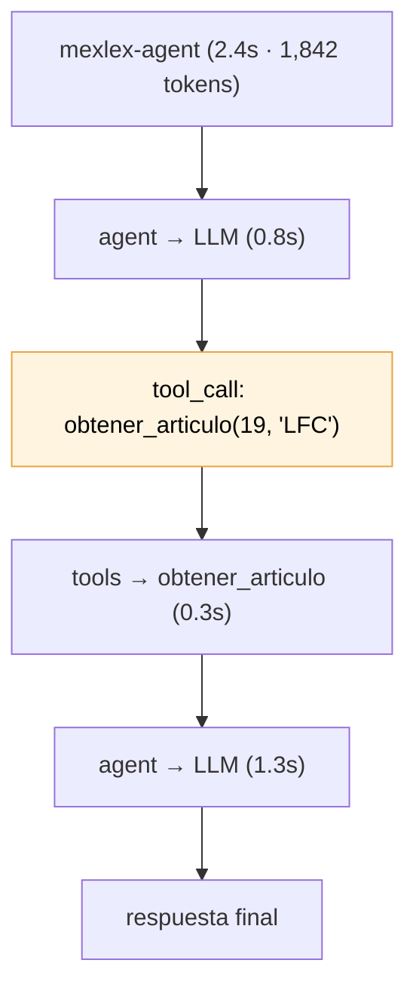

# Fase 6 — Trazabilidad, evaluación, disclaimers y citas

> **El problema de fondo:** un agente decide. Cuando responde algo raro, no tienes forma de saber *por qué*; y cuando tocas un prompt, no tienes forma de saber *qué rompiste*.
> **Lo que agrega esta fase:** visibilidad (LangSmith), una red de seguridad (suite de evaluación), y disclaimers/citas que dicen algo real en vez de boilerplate.

---

## 1. LangSmith: qué es y por qué ahora

LangSmith es la plataforma de observabilidad de LangChain. Registra cada ejecución — cada llamada al LLM, cada tool, cada nodo del grafo — con sus entradas, salidas, latencia, tokens y costo, y te lo muestra como un **árbol navegable**.



**Por qué se vuelve valioso justo ahora y no antes:** en las fases 1-3 el flujo era fijo — la traza siempre era la misma y podías razonarla de memoria. Desde la Fase 4 el modelo elige, y la pregunta que te vas a hacer al depurar es *"¿por qué usó esa tool, con qué argumentos, y qué le devolvió?"*. Eso es exactamente lo que LangSmith te muestra.

En este proyecto hay tres cosas que solo se ven bien ahí:

| Qué quieres saber | Dónde se ve |
|---|---|
| Por qué eligió `buscar_en_leyes` en vez de `obtener_articulo` | El mensaje del LLM con su `tool_call` y los argumentos |
| Qué fragmentos recibió realmente | El output de la tool, completo y sin truncar |
| Dónde se va el tiempo y el costo | Latencia y tokens por nodo |

### Cómo se activa

**No hay que instrumentar nada.** LangChain y LangGraph ya emiten los eventos; solo hacen falta variables de entorno:

```bash
LANGSMITH_TRACING=true
LANGSMITH_API_KEY=lsv2_...        # gratis en https://smith.langchain.com
LANGSMITH_PROJECT=mexlex-agent
```

> ⚠️ **Una trampa específica de este proyecto.** `pydantic-settings` lee el `.env` por su cuenta, pero **no lo exporta a `os.environ`** — y el tracer de LangChain lee de `os.environ`. Poner las variables en el `.env` y esperar que funcione es el error natural aquí. Por eso existe `setup_tracing()` en [`observability.py`](../src/mexlex/observability.py): copia los valores explícitamente. Si no configuras nada, el tracing queda apagado y la app corre igual.

### Trazas que se pueden encontrar

Una traza sin etiquetas se ve como una lista de `RunnableSequence` sin contexto. `run_config()` le pone nombre, tags y metadata:

```python
def run_config(thread_id: str, pregunta: str) -> dict:
    return {
        "configurable": {"thread_id": thread_id},   # lo usa el checkpointer
        "run_name": "mexlex-agent",
        "tags": ["mexlex", "agente"],
        "metadata": {"thread_id": thread_id, "pregunta": pregunta[:200]},
    }
```

El `thread_id` va en los dos lados a propósito: dentro de `configurable` porque es lo que necesita la memoria, y dentro de `metadata` porque es lo que hace la traza **buscable** por conversación.

---

## 2. Evaluación: la parte que más vas a usar

Con un flujo fijo bastaba con probar a mano. Con un agente, **un cambio inocuo en el system prompt puede romper un caso que ya funcionaba** sin que te enteres — y lo notas semanas después.

[`scripts/run_eval.py`](../scripts/run_eval.py) corre el agente sobre [`data/eval/casos.json`](../data/eval/casos.json) y verifica cuatro cosas medibles sin juez humano:

| Criterio | Qué detecta |
|---|---|
| **Tool elegida** | ¿usó `obtener_articulo` cuando había un número? |
| **Artículo recuperado** | ¿las fuentes incluyen el artículo pedido? ← el bug de la Fase 5 |
| **Contenido** | ¿la respuesta menciona lo que debe? |
| **Honestidad** | ante un artículo inexistente, ¿lo admite o lo inventa? |

```
$ python scripts/run_eval.py

[PASA] articulo-exacto          tools=['obtener_articulo'] articulos=[19, 20]
[PASA] articulo-sin-guion       tools=['obtener_articulo'] articulos=[47]
[PASA] tematica                 tools=['buscar_en_leyes']  articulos=[18,19,20,21,22]
[PASA] seguimiento              tools=['obtener_articulo'] articulos=[19, 20]
[PASA] charla-sin-tools         tools=[]                   articulos=[]
[PASA] fuera-de-corpus          tools=['obtener_articulo'] articulos=[]
[PASA] ambiguedad-entre-leyes   tools=['obtener_articulo'] articulos=[19, 20, 21]
[PASA] otra-ley                 tools=['obtener_articulo'] articulos=[1]

8/8 casos pasaron
```

Sale con exit code ≠ 0 si algo falla, así que se puede encadenar en CI.

### Dos decisiones de diseño

**Los evaluadores son deterministas, no un LLM-como-juez.** Un LLM juez es más flexible pero cuesta tokens e introduce varianza: el mismo caso puede pasar y fallar en corridas distintas. Para una suite de *regresión*, estabilidad > sofisticación.

**Los artículos se leen del `artifact`, no del texto.** La señal de si el retrieval funcionó está en qué fragmentos se recuperaron, no en cómo el modelo los redactó. Es la diferencia entre evaluar el sistema y evaluar la prosa.

### El problema del parafraseo (y qué enseña)

El primer caso falló así:

```
[FALLA] articulo-exacto
        tools=['obtener_articulo'] articulos=[19, 20]
        -> la respuesta no menciona 'diez por ciento'
```

Pero el agente hizo todo bien: eligió la tool correcta y recuperó el artículo 19. Solo escribió **"10%"** donde la ley dice **"diez por ciento"**. El fallo era del evaluador.

Esto es *el* problema central de evaluar salidas de LLM de forma determinista: la respuesta correcta no tiene una única forma. La solución que se aplicó fue permitir alternativas equivalentes:

```json
"debe_contener": [["diez por ciento", "10%", "10 %"], "exhibición"]
```

Un término puede ser una lista, y basta con que aparezca una. Un evaluador que reporta fallos que no lo son deja de usarse — y entonces no sirve de nada.

---

## 3. Disclaimers con contenido, no boilerplate

El plan original pedía "disclaimers legales". La tentación es pegar *"esto no es asesoría legal"* al final de cada respuesta. El problema: un aviso que aparece siempre deja de leerse.

El enfoque de esta fase es **anclar los avisos a datos reales**.

### La vigencia

Los PDFs de la Cámara de Diputados traen en el encabezado corrido:

```
Última Reforma DOF 22-03-2021
```

Ese dato ya lo estábamos **tirando a la basura** al limpiar el encabezado en la Fase 5. Ahora se extrae antes de limpiar y se guarda como metadata:

```python
ULTIMA_REFORMA = re.compile(
    r"(?i)[úu]ltima\s+reforma\s+(?:publicada\s+)?DOF[\s:]+(\d{2}-\d{2}-\d{4})"
)
```

Detectado en tu corpus:

| Ley | Vigencia |
|---|---|
| Ley Federal de Cinematografía | 22-03-2021 |
| Ley Federal de Protección de Datos Personales… | 14-11-2025 |

Con eso el aviso deja de ser genérico:

> ⚠️ Textos vigentes al 22-03-2021; pueden existir reformas posteriores.

Y como la vigencia va también en la cita que ve el LLM, el propio agente puede advertir cuando la pregunta depende de que el texto esté actualizado.

> 💡 **Sin recrear el índice.** `vigencia` se guarda solo en el JSON del campo `metadata`, no como campo declarado: se usa para mostrar, nunca para filtrar. Como `langchain_community` parsea ese JSON de vuelta a `Document.metadata`, basta con reingestar sobre el mismo índice — las claves determinísticas sobreescriben.

### Avisos condicionales

En el system prompt, la instrucción es explícita sobre **no** repetir disclaimers genéricos, y advertir solo en cuatro casos concretos: caso particular del usuario, dependencia de la vigencia, uso de fuente web, e interpretación vs. cita literal.

En la UI, el pie del mensaje se arma según lo que realmente pasó:

```
⚠️ Textos vigentes al 22-03-2021; pueden existir reformas posteriores.
   Esto no sustituye asesoría legal profesional.
```
```
⚠️ Parte de la información proviene de búsqueda web, no del corpus
   oficial indexado. Esto no sustituye asesoría legal profesional.
```

---

## 4. Mejor manejo de citas

### Nombres legibles

Los PDFs oficiales traen los títulos en mayúsculas. Citarlos así se lee como si el asistente gritara:

```
antes:  LEY FEDERAL DE CINEMATOGRAFÍA · arts. 19-20 · p. 3
ahora:  Ley Federal de Cinematografía · arts. 19-20 · p. 3
```

`nombre_legible()` capitaliza respetando las preposiciones (`de`, `del`, `la`…), con la primera palabra siempre en mayúscula.

### Dos niveles de cita

Una distinción que vale la pena tener clara:

| Función | Quién la ve | Contenido |
|---|---|---|
| `cita_de()` | **El LLM** | `Ley Federal de Cinematografía · arts. 19-20 · p. 3 · vigente al 22-03-2021 · ref LFC#12` |
| `titulo_de()` | **El usuario** | `Ley Federal de Cinematografía · arts. 19-20 · p. 3` |

La `ref` es maquinaria interna: el agente la necesita para pedir contexto vecino, pero al usuario no le dice nada. El system prompt le prohíbe explícitamente citar la `ref` o el nombre del archivo PDF.

### Fuentes web de primera clase

Aquí había un hueco real de la Fase 4. `TavilySearch` usa `response_format="content"`, así que **no produce `artifact`**: sus resultados llegaban al modelo como texto plano y nunca aparecían en el panel de fuentes.

La solución fue envolverla en una tool propia, `buscar_en_web`, que sí devuelve `(texto, fuentes)`. Ahora las fuentes web se muestran igual que las del corpus pero marcadas:

```
**Fuentes consultadas**
- Ley Federal de Cinematografía · arts. 19-20 · p. 3
- 🌐 Iniciativa que reforma el artículo 8º de la Ley Federal de…
```

Cada fuente lleva `origen: "corpus" | "web"`, que es lo que dispara el aviso correspondiente. De paso, esto verificó la ruta de Tavily end-to-end por primera vez.

---

## 5. Archivos

| Archivo | Estado | Qué es |
|---|---|---|
| `src/mexlex/observability.py` | 🆕 | Tracing de LangSmith + metadata de runs |
| `src/mexlex/evaluation.py` | 🆕 | Runner y evaluadores deterministas |
| `scripts/run_eval.py` | 🆕 | CLI de la suite de evaluación |
| `data/eval/casos.json` | 🆕 | 8 casos de regresión |
| `tests/test_citations.py` | 🆕 | 18 tests de citas, vigencia y evaluadores |
| `src/mexlex/tools/web_search_tool.py` | ✏️ | Tavily envuelta, con fuentes |
| `src/mexlex/ingestion/structure.py` | ✏️ | Extracción de la vigencia |
| `src/mexlex/retrieval/formatting.py` | ✏️ | Nombres legibles, vigencia, origen |
| `src/mexlex/agent/prompts.py` | ✏️ | Política de advertencias |
| `app/chainlit_app.py` | ✏️ | Tracing + disclaimers condicionales |
| `src/mexlex/config.py` | ✏️ | Settings de LangSmith |

---

## 6. Verificación

**Sin Azure** — 61 tests (`python -m pytest tests/ -q`), 18 nuevos: normalización de nombres, extracción de vigencia en sus dos variantes, los dos niveles de cita, y los evaluadores (incluido el caso de alucinación).

**Contra Azure** — `python scripts/run_eval.py`: **8/8 casos**.

**En la UI** — verificado por websocket:
- Pregunta de artículo → panel de fuentes con nombre legible + aviso de vigencia real.
- Pregunta sobre reformas de 2025 → el agente salió a `buscar_en_web`, las fuentes aparecieron marcadas con 🌐 y el aviso cambió al de fuente web.

---

## 7. Conceptos nuevos

| Concepto | Para qué |
|---|---|
| LangSmith / tracing | Ver por qué el agente decidió lo que decidió |
| `run_name`, `tags`, `metadata` | Trazas buscables en vez de una lista anónima |
| Evaluación de regresión | Detectar que un cambio de prompt rompió algo |
| Evaluadores deterministas vs. LLM-juez | Estabilidad > sofisticación en regresión |
| Alternativas en las aserciones | Convivir con el parafraseo del LLM |
| Disclaimers anclados a datos | Avisos que se leen porque dicen algo |
| Envolver una tool de terceros | Homogeneizar el manejo de citas |

---

## 8. Limitaciones y siguientes pasos naturales

- **La suite tiene 8 casos.** Es un piso, no una cobertura. Cada bug que encuentres debería convertirse en un caso nuevo.
- **Los evaluadores no juzgan calidad**, solo comportamiento verificable. Evaluar "¿es una buena explicación?" requiere un LLM juez o revisión humana.
- **El tracing no está probado end-to-end** — no hay `LANGSMITH_API_KEY` en el `.env`. El código sí verifica que sin key se apaga limpiamente.
- **La vigencia depende del formato del PDF.** Si una ley no trae "Última Reforma DOF", el aviso cae al genérico.
- **`MemorySaver` sigue siendo en memoria** (Fase 3): el historial se pierde al reiniciar. Es el siguiente cambio obvio si esto pasara a algo real — ver [08-fase7-persistencia-cosmosdb.md](./08-fase7-persistencia-cosmosdb.md).
- **El índice viejo `mexlex-index` sigue existiendo** ocupando 1 de los 3 slots del tier gratuito.

---

⬅️ **Anterior:** [06-fase5-retrieval-estructurado.md](./06-fase5-retrieval-estructurado.md) — la precisión que estas citas ahora comunican.
➡️ **Siguiente:** [08-fase7-persistencia-cosmosdb.md](./08-fase7-persistencia-cosmosdb.md) — que el historial deje de vivir en RAM.
