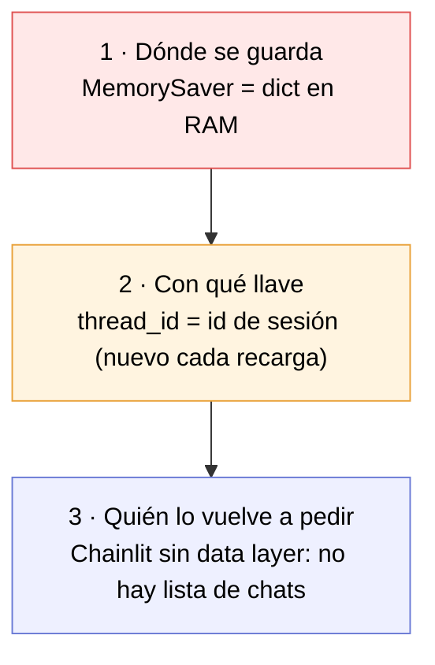
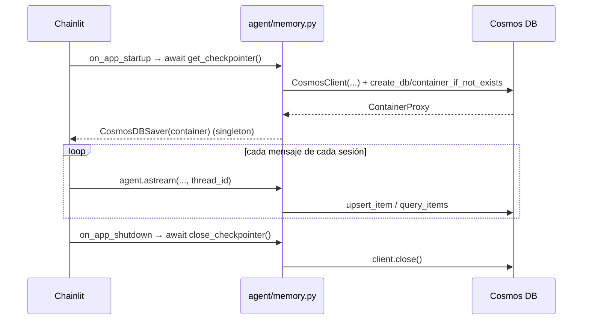

# Fase 7 — Persistencia del historial en Azure Cosmos DB NoSQL

> **El problema que resuelve:** hoy el historial vive en un diccionario de Python. Reinicias el servidor (o `chainlit -w` recarga el archivo) y **todas las conversaciones desaparecen**.
> **Cómo se resuelve:** se cambia el checkpointer `MemorySaver` por `CosmosDBSaver`, el checkpointer oficial de LangGraph para Cosmos DB NoSQL. El grafo no se entera: sigue siendo `compile(checkpointer=...)`.
> **El detalle que casi todos pasan por alto:** persistir el checkpoint **no** hace que aparezca el historial en la UI. El `thread_id` que usa la app hoy es efímero, así que aunque el estado quede guardado, nadie vuelve a apuntar a él. Son dos problemas distintos y este documento separa cuál resuelve cuál.

---

## 1. Diagnóstico: por qué "actualmente no sucede"

No es un solo eslabón roto, son tres. Vale la pena verlos juntos antes de tocar código, porque arreglar solo el primero da una sensación falsa de haber terminado.



| # | Eslabón | Estado hoy | Consecuencia |
|---|---|---|---|
| 1 | **Almacenamiento** | [`memory.py:34`](../src/mexlex/agent/memory.py#L34) devuelve `MemorySaver()` | El estado vive en el proceso. Se pierde al reiniciar y no se comparte entre workers. |
| 2 | **Identidad de la conversación** | [`chainlit_app.py:62`](../app/chainlit_app.py#L62) usa `cl.user_session.get("id")` | Ese es el id de **sesión de websocket**, un UUID nuevo en cada recarga del navegador. Aunque el estado quedara guardado, nunca volverías a pedir el mismo `thread_id`. |
| 3 | **Recuperación desde la UI** | No hay data layer de Chainlit configurado | El front no tiene barra lateral de conversaciones y nunca dispara `@cl.on_chat_resume`. |

**Esta fase resuelve el 1 y el 2.** El 3 es un problema de Chainlit, no de LangGraph, y se trata en la [sección 11](#11-lo-que-esta-fase-no-resuelve).

Con 1 y 2 arreglados ya tienes lo que pediste — *el histórico de conversaciones almacenado en Cosmos DB* — y puedes reanudar cualquier conversación conociendo su `thread_id`. Lo que falta después es solo la vitrina.

---

## 2. Qué paquete usar

LangGraph no trae checkpointer de Cosmos DB en el core (trae memoria, SQLite y Postgres). Las opciones reales:

| Opción | Veredicto |
|---|---|
| **`langchain-azure-cosmosdb`** (repo `langchain-ai/langchain-azure`) | ✅ **La que usamos.** Oficial, mantenida por LangChain + el equipo de Cosmos DB. Trae `CosmosDBSaver` (async) y `CosmosDBSaverSync`. |
| `langgraph-checkpoint-cosmosdb` (comunidad) | Implementación de un tercero, anterior a la oficial. Sin razón para preferirla hoy. |
| Escribir un `BaseCheckpointSaver` a mano | Son ~600 líneas y hay que resolver serialización, writes pendientes y paginación. Solo si necesitas un esquema de documento propio. |
| `langgraph-checkpoint-postgres` | La ruta trillada, pero implica otro recurso de Azure. Si el objetivo es Cosmos, no aplica. |

### Compatibilidad, verificada

`langchain-azure-cosmosdb` 1.0.0 pide `langchain-core>=1.0,<2.0` y `langgraph-checkpoint>=2.1.2,<5.0`. El venv del proyecto tiene `langchain-core` 1.5.1, `langgraph` 1.2.9 y `langgraph-checkpoint` 4.1.1: entra sin conflictos. Un `pip install --dry-run` confirma que solo agrega **dos** paquetes:

```
Would install azure-cosmos-4.16.3 langchain-azure-cosmosdb-1.0.0
```

Nada se degrada ni se actualiza. Es un cambio barato.

---

## 3. El detalle que rompe: `CosmosDBSaver` vs `CosmosDBSaverSync`

El paquete expone dos clases y **no son intercambiables**:

```python
from langchain_azure_cosmosdb import CosmosDBSaverSync   # solo métodos sync
from langchain_azure_cosmosdb.aio import CosmosDBSaver   # métodos async (+ puente sync)
```

`CosmosDBSaverSync` implementa `get_tuple`, `list`, `put`, `put_writes` — y **nada más**. Los métodos `aget_tuple`, `alist`, `aput`, `aput_writes` los hereda de `BaseCheckpointSaver`, donde el cuerpo es literalmente `raise NotImplementedError`.

Nuestra app corre `agent.astream(...)` desde Chainlit. Con el saver sync, el primer turno revienta:

```
NotImplementedError
  at langgraph.checkpoint.base.BaseCheckpointSaver.aget_tuple
```

**Regla:** en este proyecto va el async, `langchain_azure_cosmosdb.aio.CosmosDBSaver`. El sync solo sirve para `graph.invoke()` en un script sin event loop.

> El async además trae un puente inverso (`get_tuple` y compañía delegan al loop con `run_coroutine_threadsafe`), pero solo funciona desde **otro** hilo; llamarlo desde el loop principal lanza `InvalidStateError`. No lo necesitamos.

---

## 4. El ciclo de vida del cliente (aquí está la trampa de diseño)

El ejemplo del README oficial es este:

```python
async with CosmosDBSaver.from_conn_info(
    endpoint=..., key=..., database_name=..., container_name=...
) as saver:
    graph = workflow.compile(checkpointer=saver)
    await graph.ainvoke(...)
```

`from_conn_info` es un **`@asynccontextmanager`**: al salir del `async with` cierra el `CosmosClient`. Perfecto para un script; inservible para un servidor, donde el saver tiene que sobrevivir a miles de peticiones.

Y no se puede envolver en el `@lru_cache` que usa `memory.py` hoy: `lru_cache` no entiende corrutinas, y aunque entrara, nadie cerraría el cliente al apagar la app.

**La solución:** hacer nosotros lo que `from_conn_info` hace por dentro — crear el cliente, la base y el contenedor — y **quedarnos con el cliente** a nivel de módulo, cerrándolo en el hook de apagado de Chainlit. `CosmosDBSaver.__init__` acepta directamente un `ContainerProxy` async, así que es exactamente lo mismo, sin el context manager.



Ventaja extra de construirlo a mano: podemos elegir **no** llamar a `create_*_if_not_exists`. Esas son operaciones de plano de control, y un identity con solo el rol de datos de Cosmos (`Cosmos DB Built-in Data Contributor`) **no** tiene permiso para ejecutarlas. Ver [sección 8](#8-aprovisionamiento-en-azure).

---

## 5. Archivos nuevos y modificados

| Archivo | Estado | Qué cambia |
|---|---|---|
| `requirements.txt` | ✏️ | `langchain-azure-cosmosdb>=1.0.0` |
| `src/mexlex/config.py` | ✏️ | Bloque de settings de Cosmos |
| `.env.example` | ✏️ | Variables nuevas, documentadas |
| `src/mexlex/agent/memory.py` | ✏️ | `get_checkpointer()` async + `close_checkpointer()` + fallback |
| `src/mexlex/agent/graph.py` | ✏️ | `build_agent(checkpointer=None)` — inyección en vez de import |
| `src/mexlex/chains/conversational_rag.py` | ✏️ | Lo mismo para el grafo de la Fase 3, que también importaba el checkpointer |
| `app/chainlit_app.py` | ✏️ | Hooks de startup/shutdown + `thread_id` estable |
| `scripts/agent_test.py` | ✏️ | Recibe `thread_id` por argv, inyecta el checkpointer y lo cierra al salir |
| `scripts/chat_test.py` | ✏️ | Igual, para el grafo de la Fase 3 |
| `scripts/run_eval.py` | ✏️ | Comentario: sigue **sin** checkpointer a propósito, para no ensuciar la base con hilos de evaluación |
| `scripts/cosmos_memory_test.py` | 🆕 | Inspecciona lo guardado para un `thread_id` |
| `tests/test_memory_cosmos.py` | 🆕 | Tests del fallback, el singleton y la inyección (sin Azure) |
| `README.md` | ✏️ | Roadmap (Fase 7 ✅, Fase 8 pendiente) y pasos de verificación |

---

## 6. El código

### 6.1 `config.py` — las variables

Mismo criterio que Tavily y LangSmith en fases anteriores: **si no está configurado, la app sigue funcionando**, solo que sin la funcionalidad.

```python
    # --- Persistencia del historial (Fase 7) ---
    # Sin endpoint, el checkpointer cae a MemorySaver (memoria del proceso).
    cosmos_endpoint: str | None = Field(default=None, alias="AZURE_COSMOS_ENDPOINT")
    # Sin key se usa DefaultAzureCredential (Managed Identity / az login).
    cosmos_key: str | None = Field(default=None, alias="AZURE_COSMOS_KEY")
    cosmos_database: str = Field("mexlex", alias="AZURE_COSMOS_DATABASE")
    cosmos_container: str = Field("checkpoints", alias="AZURE_COSMOS_CONTAINER")
    # Retención: None = para siempre. 2592000 = 30 días.
    cosmos_ttl_seconds: int | None = Field(default=None, alias="AZURE_COSMOS_TTL_SECONDS")
    # Deja en false si el identity solo tiene permisos de plano de datos.
    cosmos_create_if_missing: bool = Field(True, alias="AZURE_COSMOS_CREATE_IF_MISSING")
```

### 6.2 `agent/memory.py` — el checkpointer

Reemplaza el archivo completo. Los tres cambios de fondo: es `async`, guarda referencias al cliente para poder cerrarlo, y degrada a `MemorySaver` si no hay endpoint.

```python
_checkpointer: BaseCheckpointSaver | None = None
_client = None       # azure.cosmos.aio.CosmosClient
_credential = None   # azure.identity.aio.DefaultAzureCredential
_lock = asyncio.Lock()


async def get_checkpointer() -> BaseCheckpointSaver:
    global _checkpointer, _client, _credential

    async with _lock:
        if _checkpointer is not None:
            return _checkpointer

        if not settings.cosmos_endpoint:
            logger.warning(
                "AZURE_COSMOS_ENDPOINT no configurado: el historial vive en "
                "memoria del proceso y se pierde al reiniciar."
            )
            _checkpointer = MemorySaver()
            return _checkpointer

        # Import diferido: sin Cosmos configurado no queremos ni cargar
        # el SDK de Azure (ni obligar a tenerlo instalado).
        from azure.cosmos import PartitionKey
        from azure.cosmos.aio import CosmosClient
        from langchain_azure_cosmosdb.aio import CosmosDBSaver

        if settings.cosmos_key:
            credential = settings.cosmos_key
        else:
            from azure.identity.aio import DefaultAzureCredential

            _credential = DefaultAzureCredential()
            credential = _credential

        _client = CosmosClient(
            settings.cosmos_endpoint, credential, user_agent="mexlex-agent"
        )

        if settings.cosmos_create_if_missing:
            database = await _client.create_database_if_not_exists(
                settings.cosmos_database
            )
            container = await database.create_container_if_not_exists(
                id=settings.cosmos_container,
                partition_key=PartitionKey(path=PARTITION_KEY_PATH),
                default_ttl=settings.cosmos_ttl_seconds,
            )
        else:
            # Plano de datos puro: el contenedor ya tiene que existir.
            database = _client.get_database_client(settings.cosmos_database)
            container = database.get_container_client(settings.cosmos_container)

        _checkpointer = CosmosDBSaver(container)
        return _checkpointer


async def close_checkpointer() -> None:
    """Cierra el cliente de Cosmos. Idempotente."""
    global _checkpointer, _client, _credential

    if _client is not None:
        await _client.close()
        _client = None
    if _credential is not None:
        await _credential.close()
        _credential = None
    _checkpointer = None
```

Cuatro decisiones que vale la pena justificar:

- **`asyncio.Lock`.** Sin él, dos sesiones que abren al mismo tiempo pueden crear dos clientes y filtrar uno. En la práctica la app lo inicializa en el arranque, pero un singleton async sin lock es una bomba de tiempo barata de desactivar.
- **Imports diferidos.** El `azure.cosmos` y el `langchain_azure_cosmosdb` se importan dentro de la rama que los usa. Así un `.env` sin Cosmos ni siquiera carga el SDK, y el proyecto sigue arrancando si alguien no instaló el paquete opcional. Es el mismo criterio que ya usa `web_search_tool.py` con Tavily.
- **`PartitionKey(path="/partition_key")`.** No es una elección nuestra: es la ruta que el saver escribe en cada documento. Si creas el contenedor a mano con otra partition key, nada funciona. Por eso está como constante `PARTITION_KEY_PATH` con su comentario, y no como literal suelto.
- **`default_ttl` solo aplica al crear.** Si el contenedor ya existe, este parámetro se ignora en silencio; hay que cambiarlo desde el portal.

### 6.3 `agent/graph.py` — inyectar en vez de importar

```python
def build_agent(checkpointer: BaseCheckpointSaver | None = None):
    """Compila el agente ReAct con memoria.

    El checkpointer se inyecta porque construirlo es async (abre la
    conexión a Cosmos) y esta función no lo es. Quien llama lo obtiene
    una vez con `await get_checkpointer()` y lo reusa.
    """
    return create_react_agent(
        model=get_llm(),
        tools=get_tools(),
        prompt=AGENT_SYSTEM_PROMPT,
        checkpointer=checkpointer or MemorySaver(),
    )
```

> ⚠️ El `or MemorySaver()` crea **uno nuevo por llamada**. Es el comportamiento correcto para tests, y es una trampa si alguien llama `build_agent()` sin argumentos una vez por sesión: cada sesión tendría su propia memoria aislada. Por eso la app siempre inyecta.

### 6.4 `app/chainlit_app.py` — arranque, apagado y el `thread_id`

```python
from mexlex.agent.memory import close_checkpointer, get_checkpointer

_checkpointer = None


@cl.on_app_startup
async def on_app_startup() -> None:
    """Una vez por proceso: abre la conexión a Cosmos."""
    global _checkpointer
    _checkpointer = await get_checkpointer()


@cl.on_app_shutdown
async def on_app_shutdown() -> None:
    await close_checkpointer()


@cl.on_chat_start
async def on_chat_start() -> None:
    cl.user_session.set("agent", build_agent(_checkpointer))
    # ANTES: cl.user_session.get("id")  ← id de websocket, nuevo en cada recarga
    cl.user_session.set("thread_id", cl.context.session.thread_id)
```

**El cambio de `thread_id` es tan importante como el checkpointer.** Chainlit distingue dos identificadores:

| Atributo | Qué es | Vida |
|---|---|---|
| `cl.user_session.get("id")` | Id de la sesión de websocket | Nuevo en **cada** conexión: recargar F5 ya es otro |
| `cl.context.session.thread_id` | Id de la conversación | El que manda el front al reanudar un hilo; si no manda ninguno, un UUID nuevo |

Con el primero, Cosmos se llenaría de hilos huérfanos de un solo turno. Con el segundo, la app queda lista para reanudar en cuanto exista quien mande el id (ver [sección 11](#11-lo-que-esta-fase-no-resuelve)).

### 6.5 Los scripts

`agent_test.py` y `chat_test.py` cambian igual: inyectan el checkpointer, aceptan el `thread_id` por argumento y cierran el cliente en un `finally`.

```python
async def main() -> None:
    agent = build_agent(await get_checkpointer())
    thread_id = sys.argv[1] if len(sys.argv) > 1 else str(uuid.uuid4())
    try:
        ...
    finally:
        # Sin esto el cliente async de Cosmos se queja al salir.
        await close_checkpointer()
```

Aceptar el `thread_id` por argumento es lo que los convierte en la prueba de la fase: corres, sales, vuelves a correr con el mismo id y el agente se acuerda.

---

## 7. Cómo queda el dato en Cosmos

Esto no aparece en la documentación del paquete, pero es lo que vas a ver en el Data Explorer, así que conviene entenderlo.

El saver escribe **dos tipos de documento** en el mismo contenedor, distinguidos por el prefijo del `id`. El separador es `$`.

### Documento de checkpoint

```jsonc
{
  "id":            "checkpoint$<thread_id>$<checkpoint_ns>$<checkpoint_id>",
  "partition_key": "checkpoint$<thread_id>$<checkpoint_ns>$",
  "thread_id":     "<thread_id>",
  "type":          "msgpack",
  "checkpoint":    "<base64 del estado completo del grafo>",
  "metadata":      ["msgpack", "<base64>"],
  "parent_checkpoint_id": "<checkpoint_id anterior o ''>"
}
```

### Documento de writes (escrituras pendientes de un nodo)

```jsonc
{
  "id":            "writes$<thread_id>$<ns>$<checkpoint_id>$<task_id>$<idx>",
  "partition_key": "writes$<thread_id>$<ns>$<checkpoint_id>$",
  "thread_id":     "<thread_id>",
  "channel":       "messages",
  "type":          "msgpack",
  "value":         "<base64>"
}
```

Cuatro consecuencias prácticas:

1. **La partition key es la conversación, no el thread_id crudo.** Todos los checkpoints de un hilo caen en la misma partición lógica, así que listar o rehidratar una conversación es una consulta de partición única — la más barata en Cosmos. Los writes se particionan por checkpoint.
2. **`$` está prohibido** en `thread_id`, `checkpoint_ns` y `task_id`: el saver lanza `ValueError` si lo encuentra. Los UUID de Chainlit no lo traen, pero si algún día derivas el `thread_id` de un email o de un nombre, aquí truena.
3. **Los blobs van en base64 sobre msgpack**, no en JSON legible. No vas a poder leer los mensajes desde el portal, ni filtrar con SQL por contenido. Para eso está LangSmith (Fase 6).
4. **El orden es lexicográfico por `id` y funciona.** LangGraph genera los `checkpoint_id` como UUIDv6, que son ordenables por tiempo. Por eso el `ORDER BY c.id DESC` del saver devuelve el checkpoint más reciente primero sin necesidad de índice ni de campo de fecha.

---

## 8. Aprovisionamiento en Azure

### Recurso

Una cuenta de Cosmos DB **API for NoSQL**. La capa gratuita (1000 RU/s + 25 GB, una por suscripción) sobra para esto. **Serverless** es incluso mejor para un proyecto de aprendizaje: pagas por operación y no hay RU/s reservadas.

```bash
az cosmosdb create -n mexlex-cosmos -g <rg> --locations regionName=eastus \
  --capabilities EnableServerless
az cosmosdb sql database create -a mexlex-cosmos -g <rg> -n mexlex
az cosmosdb sql container create -a mexlex-cosmos -g <rg> -d mexlex \
  -n checkpoints --partition-key-path /partition_key --ttl 2592000
```

Si creas el contenedor así, pon `AZURE_COSMOS_CREATE_IF_MISSING=false` y el código no intentará crearlo.

### Autenticación

| Modo | Cómo | Cuándo |
|---|---|---|
| **Access key** | `AZURE_COSMOS_KEY=<key>` | Desarrollo local. Es lo mismo que ya hacemos con Azure AI Search. |
| **Entra ID** | Dejar `AZURE_COSMOS_KEY` vacío → `DefaultAzureCredential` | Producción. Toma la Managed Identity, o tu `az login` en local. |

⚠️ Con Entra ID hace falta el rol **de plano de datos** (`Cosmos DB Built-in Data Contributor`), que se asigna con `az cosmosdb sql role assignment create` — **no** desde el IAM del portal, que solo cubre el plano de control. Y ese rol **no permite crear bases ni contenedores**: por eso existe `cosmos_create_if_missing`.

### Local sin Azure

El emulador de Cosmos DB corre en Docker y habla el mismo protocolo:

```bash
docker run -p 8081:8081 -p 10250-10255:10250-10255 \
  mcr.microsoft.com/cosmosdb/linux/azure-cosmos-emulator
```

Usa su endpoint y su key bien conocida. Ojo: certificado autofirmado, hay que confiarlo o desactivar la verificación TLS.

### `.env.example`

```bash
# --- Persistencia del historial (Fase 7, opcional) ---
# Sin endpoint el historial vive en memoria y se pierde al reiniciar.
AZURE_COSMOS_ENDPOINT=https://<tu-cuenta>.documents.azure.com:443/
# Vacío = DefaultAzureCredential (Managed Identity / az login).
AZURE_COSMOS_KEY=<tu-primary-key>
AZURE_COSMOS_DATABASE=mexlex
AZURE_COSMOS_CONTAINER=checkpoints
# Retención en segundos. Vacío = para siempre. 2592000 = 30 días.
# Solo aplica si el contenedor lo crea el código.
AZURE_COSMOS_TTL_SECONDS=2592000
# false si el identity solo tiene permisos de plano de datos.
AZURE_COSMOS_CREATE_IF_MISSING=true
```

---

## 9. Lo que esto cuesta

Con `MemorySaver` la memoria era gratis. Ahora cada turno son varias escrituras de red, y conviene tener el orden de magnitud en la cabeza.

**LangGraph escribe un checkpoint por super-step**, no por turno. Un turno del agente ReAct con una búsqueda son ~3 super-steps (`agent` → `tools` → `agent`), más un documento de write por cada canal actualizado. Cuenta **entre 6 y 12 escrituras por pregunta**.

Y lo que más pesa: **cada documento de checkpoint contiene el estado completo serializado**, o sea *todos* los mensajes de la conversación hasta ese momento — incluidos los `ToolMessage` con los fragmentos recuperados. Con `retrieval_k=4` y `chunk_size=1200`, cada resultado de búsqueda son ~5 KB. A los 20 turnos el documento anda por los 100 KB, y el costo en RU de una escritura crece con el tamaño.

| Riesgo | Mitigación |
|---|---|
| Documentos que crecen sin límite | TTL en el contenedor; y a mediano plazo, recortar los `ToolMessage` viejos del estado |
| Límite duro de 2 MB por documento | Solo alcanzable en conversaciones muy largas con muchas búsquedas, pero es un error real cuando pasa |
| RU/s en picos | Serverless, o autoscale si es provisionado |

El TTL del contenedor es la palanca más simple: `AZURE_COSMOS_TTL_SECONDS=2592000` borra las conversaciones a los 30 días sin escribir una línea de código de limpieza. Aplica a todos los documentos porque el saver no escribe un `ttl` propio en ninguno.

---

## 10. Verificación

El punto entero de la fase es "sobrevive al reinicio", así que la prueba tiene que cruzar la frontera del proceso.

**1. Que la conexión abre** — arrancar la app y ver en el log:

```
INFO mexlex.agent.memory: Checkpointer: Cosmos DB mexlex/checkpoints
```

**2. Que el historial sobrevive** — con `scripts/agent_test.py <thread_id>`:

```bash
python scripts/agent_test.py 11111111-1111-1111-1111-111111111111
# Tú: ¿Qué dice el artículo 10 de la Ley Federal de Cinematografía?
# ...
# Tú: salir

# El proceso murió. Volvemos con el MISMO thread_id:
python scripts/agent_test.py 11111111-1111-1111-1111-111111111111
# Tú: ¿y el siguiente artículo?
# → debe responder sobre el artículo 11 de esa misma ley
```

Si contesta el 11, el estado se rehidrató desde Cosmos. Ese es el criterio de aceptación de la fase.

**3. Que el dato está donde creemos** — `scripts/cosmos_memory_test.py`:

```python
saver = await get_checkpointer()
config = {"configurable": {"thread_id": thread_id}}
tupla = await saver.aget_tuple(config)
print("mensajes:", len(tupla.checkpoint["channel_values"]["messages"]))
print("checkpoints:", len([c async for c in saver.alist(config)]))
```

Y en el Data Explorer del portal, una consulta de partición única:

```sql
SELECT c.id FROM c
WHERE c.partition_key = 'checkpoint$11111111-1111-1111-1111-111111111111$$'
ORDER BY c.id DESC
```

**4. Que el aislamiento sigue vivo** — otro `thread_id` devuelve `None` en `aget_tuple`. El script sin argumento hace justo eso: inventa un id nuevo y debe reportar 0 checkpoints.

**5. Que sin Cosmos no se rompe** — comentar `AZURE_COSMOS_ENDPOINT` y confirmar que la app arranca con el warning y funciona igual.

### Estado de la verificación

Lo que **ya está comprobado** en este repo, sin cuenta de Cosmos:

| Qué | Cómo |
|---|---|
| La dependencia entra sin conflictos | `pip install` real: solo agrega `azure-cosmos` y `langchain-azure-cosmosdb`, sin tocar nada más |
| El cableado de Cosmos es correcto | Smoke test con el `CosmosClient` stubbeado: construye un `CosmosDBSaver` de verdad, con `/partition_key`, el `default_ttl` y el `user_agent` esperados; el singleton y el cierre funcionan |
| El fallback, el singleton y la inyección | `tests/test_memory_cosmos.py` — 10 tests, sin Azure |
| No se rompió nada de las fases 1-6 | La suite completa pasa: **70 tests** |
| Los hooks nuevos quedan registrados | Importar `app/chainlit_app.py` y revisar `config.code.on_app_startup` / `on_app_shutdown` |

Lo que **falta** y necesita una cuenta (o el emulador): los puntos 1 a 4 de arriba, es decir la ida y vuelta real contra Cosmos DB. El código está listo; la prueba end-to-end depende de aprovisionar el recurso y llenar el `.env`.

---

## 11. Lo que esta fase NO resuelve

Esto es lo que hay que decir en voz alta para que nadie se lleve una sorpresa al final de la implementación.

**Con la Fase 7 terminada, la barra lateral de Chainlit sigue vacía.** El estado del agente está guardado en Cosmos y es recuperable por `thread_id`, pero:

- Chainlit no tiene de dónde sacar la **lista** de conversaciones del usuario.
- Al recargar la página, el front no manda ningún `thread_id`, así que `cl.context.session.thread_id` genera uno nuevo y arrancas en blanco.
- `@cl.on_chat_resume` nunca se dispara.

La razón es que son **dos persistencias distintas y no se sustituyen**:

| | Checkpointer de LangGraph | Data layer de Chainlit |
|---|---|---|
| Guarda | El estado del grafo (mensajes, tool calls, canales) | Hilos, mensajes de UI, usuarios, feedback, elementos |
| Lo consume | El agente, para rehidratar el contexto | El front, para pintar la lista y reabrir un chat |
| Formato | msgpack en base64, opaco | Relacional/documental, consultable |
| Esta fase | ✅ | ❌ |

Para cerrar el círculo hace falta, además, una de estas dos:

- **Un data layer de Chainlit.** Los oficiales son SQLAlchemy (Postgres/SQLite), Literal AI y DynamoDB — **ninguno es Cosmos DB**. Habría que implementar `chainlit.data.base.BaseDataLayer` sobre el mismo contenedor (unos ~400 líneas), o aceptar un segundo almacén.
- **Autenticación.** Sin `@cl.password_auth_callback` (o header auth) Chainlit no sabe de quién es cada hilo, y "mis conversaciones" no significa nada.

Mi recomendación: dejarlo como **Fase 8** explícita en el roadmap, no colarlo aquí. Esta fase ya tiene un criterio de aceptación limpio y verificable, y mezclarla con el data layer duplicaría su tamaño.

> ✅ **Hecho en la [Fase 8](./09-fase8-historial-en-la-ui.md):** se implementó `BaseDataLayer` sobre Cosmos DB (contenedor aparte) más el login que Chainlit exige. Ahí también se resuelve el `adelete_thread` que falta en el saver.

---

## 12. Limitaciones

| Limitación | Impacto | Salida |
|---|---|---|
| ~~No hay `adelete_thread`~~ | Borrar una conversación exigía consultas manuales | ✅ Resuelto en la Fase 8: `borrar_checkpoints_del_hilo` |
| El documento crece con la conversación | Más RU por turno; techo duro de 2 MB | TTL, y recortar `ToolMessage` viejos del estado |
| Los checkpoints son ilegibles desde el portal | No puedes auditar respuestas con SQL | LangSmith (Fase 6) para eso |
| `default_ttl` solo se aplica al crear el contenedor | Cambiarlo después no tiene efecto desde el código | Portal / CLI |
| Una escritura por super-step | Latencia extra por turno frente a `MemorySaver` | Inherente a persistir |
| El fallback a `MemorySaver` es silencioso (solo un warning) | Se puede desplegar creyendo que persiste cuando no | Considerar fallar duro si `ENV=production` |
| ~~Sin barra lateral de conversaciones~~ | El usuario no veía su histórico | ✅ Resuelto en la [Fase 8](./09-fase8-historial-en-la-ui.md) |

---

## 13. Conceptos nuevos

| Concepto | Dónde | Para qué |
|---|---|---|
| Checkpointer durable | LangGraph | Que el estado sobreviva al proceso |
| `BaseCheckpointSaver` sync vs async | LangGraph | Saber cuál sirve con `astream` |
| Partition key | Cosmos DB | Que rehidratar un hilo sea una consulta de partición única |
| TTL de contenedor | Cosmos DB | Retención sin código de limpieza |
| Plano de control vs plano de datos | Azure RBAC | Por qué el rol correcto no puede crear contenedores |
| `on_app_startup` / `on_app_shutdown` | Chainlit | Recursos con vida de proceso, no de sesión |
| `session.thread_id` vs `session.id` | Chainlit | La diferencia entre conversación y conexión |
| Inyección del checkpointer | Diseño | Desacoplar una construcción async de una fábrica sync |

---

⬅️ **Anterior:** [07-fase6-trazabilidad-y-citas.md](./07-fase6-trazabilidad-y-citas.md) — la observabilidad que aquí sigue siendo tu ventana al contenido de los checkpoints.
➡️ **Siguiente:** [09-fase8-historial-en-la-ui.md](./09-fase8-historial-en-la-ui.md) — hacer visible lo que aquí quedó guardado.
