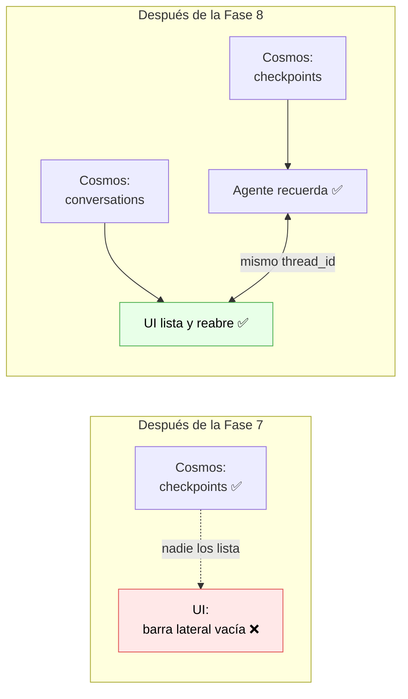
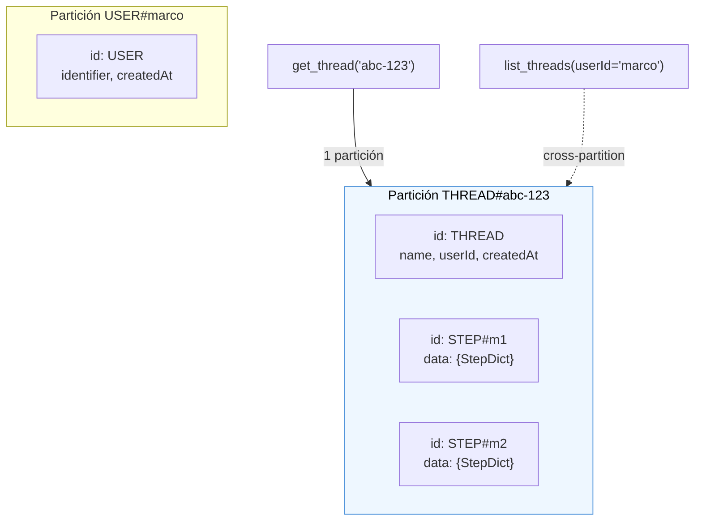
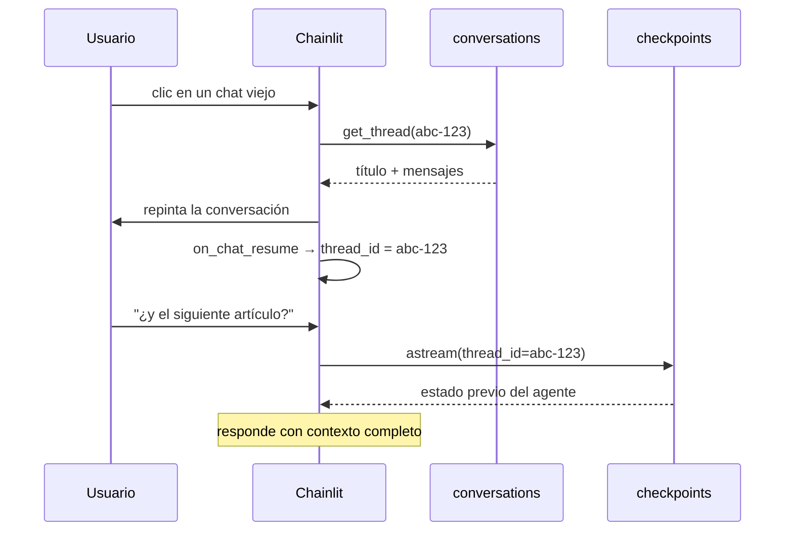

# Fase 8 — El historial visible: data layer de Chainlit sobre Cosmos DB

> **El problema que resuelve:** la Fase 7 dejó las conversaciones guardadas en Cosmos DB, pero el usuario no las ve. La barra lateral sigue vacía y cada recarga empieza en blanco. El historial existe y es inalcanzable.
> **Cómo se resuelve:** implementando `BaseDataLayer` de Chainlit sobre Cosmos DB — no hay integración oficial — más el login que Chainlit exige para saber de quién es cada hilo.
> **El detalle que casi todos pasan por alto:** son **dos** persistencias distintas y ninguna sustituye a la otra. El checkpointer guarda lo que el *agente* recuerda; el data layer, lo que la *UI* pinta. Si solo pones uno, el resultado es una conversación que se ve pero el agente no recuerda, o una que el agente recuerda pero nadie puede abrir.

---

## 1. Por qué la Fase 7 no bastaba

Al terminar la Fase 7 el estado del agente estaba en Cosmos y era recuperable con el `thread_id`. Lo que faltaba no era guardar más cosas, sino **quién le dice a la UI qué hilos existen**.



Leyendo el código de Chainlit se ve exactamente dónde se corta el circuito ([`socket.py`](../.venv/Lib/site-packages/chainlit/socket.py)):

```python
async def resume_thread(session: WebsocketSession):
    data_layer = get_data_layer()
    if not data_layer or not session.user or not session.thread_id_to_resume:
        return
```

Tres condiciones, y en la Fase 7 fallaban las tres primeras posibles: no había data layer, no había usuario y el front nunca mandaba un `thread_id` que reanudar. De ahí salen las tres piezas de esta fase.

| Pieza | Por qué es obligatoria |
|---|---|
| **Data layer** | Es el `get_data_layer()` de la línea 2. Sin él no hay de dónde sacar la lista ni los mensajes. |
| **Login** | Es el `session.user`. Chainlit filtra los hilos por `user.id` y autoriza por `user.identifier`: sin usuario, un hilo no es de nadie. |
| **`@cl.on_chat_resume`** | Sin este callback registrado, `threadResumable` va en `false` al front y la UI ni siquiera ofrece reabrir. |

---

## 2. Las dos persistencias, lado a lado

Vale la pena fijar esta tabla antes de ver código, porque es el malentendido más caro de la fase:

| | Checkpointer (Fase 7) | Data layer (Fase 8) |
|---|---|---|
| Contenedor | `checkpoints` | `conversations` |
| Guarda | Estado del grafo: mensajes como los ve el LLM, tool calls, canales | Hilos, mensajes de UI, usuarios, feedback |
| Formato | msgpack en base64, opaco | JSON consultable |
| Lo consume | El agente, para rehidratar el contexto | El front, para pintar la lista y reabrir |
| Lo escribe | LangGraph, en cada super-step | Chainlit, en cada mensaje |
| Si falta | El agente no recuerda nada | El usuario no ve su historial |

**Lo que las une es el `thread_id`.** Eso es todo el truco de la fase: como en la Fase 7 se cambió el `thread_id` para que fuera el de la *conversación* y no el de la conexión, al reabrir un hilo viejo el checkpointer encuentra su estado sin que nadie le reinyecte nada.

¿Por qué contenedores separados en vez de uno? Porque tienen forma y uso distintos: los checkpoints son blobs opacos que se leen enteros y nunca se filtran, mientras que los documentos de la UI se consultan por usuario, se ordenan por fecha y necesitan un índice compuesto. Meterlos juntos significaría indexar blobs que nunca se consultan, pagando RU de escritura por nada.

---

## 3. Archivos nuevos y modificados

| Archivo | Estado | Qué es |
|---|---|---|
| `scripts/cosmos_ui_test.py` | 🆕 | Diagnóstico: qué hay de verdad en el contenedor y qué decidiría el resume |
| `src/mexlex/persistence/__init__.py` | 🆕 | El paquete, y la explicación de qué guarda cada cosa |
| `src/mexlex/persistence/cosmos.py` | 🆕 | Fábrica del cliente, compartida con el checkpointer |
| `src/mexlex/persistence/data_layer.py` | 🆕 | `CosmosDataLayer(BaseDataLayer)` — el grueso de la fase |
| `src/mexlex/persistence/auth.py` | 🆕 | Login mínimo y el puente del secreto a `os.environ` |
| `src/mexlex/agent/memory.py` | ✏️ | Usa la fábrica común; nuevo `borrar_checkpoints_del_hilo` |
| `src/mexlex/config.py` | ✏️ | Contenedor de la UI + credenciales |
| `.env.example` | ✏️ | Variables nuevas documentadas |
| `app/chainlit_app.py` | ✏️ | Login, data layer y `@cl.on_chat_resume`, los tres condicionales |
| `tests/fake_cosmos.py` | 🆕 | Contenedor de Cosmos en memoria para los tests |
| `tests/test_data_layer.py` | 🆕 | 29 tests del data layer, sin Azure |
| `tests/test_auth.py` | 🆕 | 10 tests del login |

---

## 4. El modelo de datos

Chainlit no trae data layer de Cosmos DB (los oficiales son SQLAlchemy, Literal AI y DynamoDB). El de **DynamoDB** es el que mejor traduce, porque es el único NoSQL: una sola tabla, varios tipos de documento distinguidos por prefijo de clave. Ese es el modelo que se copió.

```
partition_key            id                  entity    contenido
────────────────────────────────────────────────────────────────────────
THREAD_<thread_id>       THREAD              thread    título, dueño, fechas
THREAD_<thread_id>       STEP_<step_id>      step      un mensaje de la UI
THREAD_<thread_id>       ELEMENT_<elem_id>   element   (no se usa, ver §8)
USER_<identifier>        USER                user      el usuario
```

### ⚠️ El separador es `_` porque `#` no se puede

Este es el bug que se comió la primera versión de la fase, y vale la pena contarlo entero porque el síntoma no apuntaba a la causa.

DynamoDB usa `#` como separador de claves compuestas (`THREAD#abc`, `STEP#m1`) y es la convención habitual en NoSQL. Al copiar el modelo, se copió el separador. Pero **Cosmos prohíbe `/`, `\`, `?` y `#` en el `id`** de un documento, y el SDK de Python lo valida del lado del cliente:

```
ValueError: Id contains illegal chars.
```

Lo que hizo que costara encontrarlo es cómo se repartió el daño:

| Documento | `id` | ¿Se escribió? |
|---|---|---|
| Hilo | `THREAD` | ✅ sin caracteres raros |
| Usuario | `USER` | ✅ sin caracteres raros |
| **Mensaje** | `STEP#<uuid>` | ❌ `ValueError` |

Así que **el login funcionaba, la barra lateral se llenaba de conversaciones, y al abrir cualquiera aparecía la pantalla de chat nuevo**: el hilo existía, pero no tenía ni un mensaje.

Y encima el error era invisible. Chainlit persiste los mensajes así:

```python
# chainlit/message.py
asyncio.create_task(data_layer.create_step(step_dict))
```

Fuego y olvido: la excepción muere dentro del task y en la UI no pasa absolutamente nada. De ahí salieron dos decisiones:

- `_guardar_paso` **registra la excepción con traceback** antes de dejarla ir, y avisa en el mensaje que ese mensaje no va a aparecer al reabrir.
- Existe `scripts/cosmos_ui_test.py`, que responde en un comando lo que el navegador no dice: cuántos mensajes tiene realmente cada conversación.

La lección general: **al portar un modelo de datos entre bases NoSQL, las restricciones de la clave son lo primero que hay que verificar**, no la forma de las consultas.

**Que todos los documentos de una conversación compartan `partition_key` es la decisión de diseño central.** Abrir un hilo es lo que más se hace, y así es una consulta de **partición única**: la más barata que existe en Cosmos.



Lo caro es lo raro: **listar** los hilos de un usuario es *cross-partition*, porque cada conversación vive en su propia partición. Para eso está el índice compuesto (§6).

### Ojo con `id`

En Cosmos, `id` no es un campo cualquiera: es el identificador del documento **dentro de su partición**. Por eso el id de la conversación va en `threadId` y el `id` se usa como discriminador (`THREAD`, `STEP#...`). Es el error clásico al portar código de otra base.

Los dicts que Chainlit espera (`StepDict`) se guardan **tal cual bajo `data`**, sin traducir campo por campo. La UI los deserializa con `Message.from_dict`, así que cualquier traducción sería una oportunidad de perder un campo cuando Chainlit agregue uno.

---

## 5. `update_thread`: el método que parece trivial y no lo es

Chainlit **no tiene `create_thread`**. La misma función crea la primera vez y actualiza después, y se llama desde lugares distintos con subconjuntos de campos distintos:

```python
# chainlit/context.py — al abrir la sesión HTTP
data_layer.update_thread(thread_id=thread_id, user_id=user_id)

# chainlit/emitter.py — al primer mensaje del usuario
data_layer.update_thread(thread_id=..., name=interaction, user_id=..., tags=tags)
```

Dos consecuencias:

**1. Solo se pisan los campos que llegan con valor.** Si `update_thread(name=...)` escribiera el documento completo, borraría el `userId` que puso la llamada anterior — y un hilo sin dueño desaparece de la lista, sin error ni log. Es un bug silencioso y desconcertante.

**2. Hay que contar con que se crucen.** La primera llamada sale en un `asyncio.create_task`, así que puede solaparse con la segunda. Por eso el upsert va con **concurrencia optimista**:

```python
for intento in range(3):
    actual = await self._leer(particion, "THREAD") or {}
    doc = { ...campos, cada uno: nuevo if nuevo is not None else actual.get(...) }
    try:
        # Si el documento ya existía, exigimos que no haya cambiado.
        await contenedor.upsert_item(doc, **_si_no_cambio(actual))
        return
    except CosmosAccessConditionFailedError:
        ...  # alguien escribió entre nuestro read y nuestro write: reintenta
```

`_si_no_cambio` manda el `_etag` del documento leído con `MatchConditions.IfNotModified`, que Cosmos traduce a un header `If-Match`. Si el documento cambió desde que lo leímos, responde **412** en vez de sobrescribir, y volvemos a leer. Sin esto, la última escritura en llegar borra lo que puso la otra.

---

## 6. `list_threads`: la barra lateral

```sql
SELECT * FROM c
WHERE c.entity = 'thread' AND c.userId = @userId
ORDER BY c.createdAt DESC
OFFSET @offset LIMIT @limit
```

Tres decisiones aquí:

**Índice compuesto.** Cosmos necesita uno cuando filtras por unas propiedades y ordenas por otra. Sin él la consulta funciona igual, pero escanea de más y el costo crece con el número de hilos. Se declara al crear el contenedor:

```python
"compositeIndexes": [[
    {"path": "/entity",    "order": "ascending"},
    {"path": "/userId",    "order": "ascending"},
    {"path": "/createdAt", "order": "descending"},
]]
```

**`data` excluido del índice.** Los `StepDict` no se consultan nunca: se leen enteros. Indexarlos sería pagar RU de escritura en cada token que streamea el LLM, a cambio de nada.

> ⚠️ Esa exclusión tiene una consecuencia que muerde: **Cosmos rechaza filtrar u ordenar por una ruta que no indexó.** `get_favorite_steps` filtraba por `c.data.metadata.favorite` y habría fallado en producción. La solución es denormalizar: el flag `favorite` y el `createdAt` se copian a la raíz del documento, fuera de `data`. Si vas a excluir del índice, revisa antes qué consultas tocan esa rama.

**Paginación por `OFFSET`, no por token de continuación.** Cosmos tiene continuation tokens "de verdad", pero para una lista de decenas de hilos `OFFSET/LIMIT` se comporta igual y el cursor es legible. Se pide **un elemento de más** que el `first` solicitado: si vuelve, hay página siguiente, y así no hay que contar el total.

---

## 7. El login (y por qué es obligatorio)

No es una funcionalidad que quisiéramos, es una que Chainlit exige. `resume_thread` corta si `session.user` es `None`, y `list_threads` filtra por `user.id`.

```python
if AUTH_ACTIVA:
    @cl.password_auth_callback
    async def auth_callback(usuario: str, password: str) -> cl.User | None:
        if credenciales_validas(usuario, password):
            return cl.User(identifier=usuario, metadata={"role": "user"})
        return None
```

**Los decoradores van dentro de un `if` a propósito.** Chainlit decide si pedir login con `require_login()`, que solo mira *si el callback existe*. Registrarlo incondicionalmente pondría una pantalla de acceso a todo el mundo aunque no haya credenciales configuradas. Con el `if`, sin credenciales en el `.env` la app corre exactamente como en la Fase 7.

Dos detalles del `auth.py`:

- **`CHAINLIT_AUTH_SECRET` hay que exportarlo a `os.environ`.** Mismo problema que con LangSmith en la Fase 6: `pydantic-settings` lee el `.env` pero no lo exporta, y Chainlit lo busca en `os.environ`. Sin el puente, la app se cae al arrancar con un `ValueError`.
- **Se comparan bytes, no str.** `hmac.compare_digest` sobre cadenas **exige que sean ASCII** y lanza `TypeError` si no lo son. Una contraseña con `ñ` o un acento tumbaría el login con un 500 en vez de rechazarlo — y en un proyecto en español esas son justo las contraseñas probables. Lo encontró un test parametrizado, no una revisión.

### El id del usuario es su identifier

Detalle pequeño con consecuencias grandes. Chainlit **filtra** los hilos por `user.id` pero **autoriza** por `user.identifier`:

```python
payload.filter.userId = persisted_user.id        # server.py, listar
await is_thread_author(current_user.identifier, thread_id)   # server.py, abrir
```

Si esos dos valores no coinciden, los hilos se guardan pero no se listan. Usar el mismo valor para ambos elimina la clase entera de bug. Hay un test que lo fija para que nadie lo "arregle" después.

> ⚠️ **Esto es una cuenta única de desarrollo, no un sistema de usuarios.** La contraseña vive en claro en el `.env`. Para algo real, Chainlit trae `@cl.oauth_callback` con Google, GitHub y **Entra ID**, que además encaja con el resto del stack de Azure de este proyecto.

---

## 8. Borrar de verdad

Cuando el usuario borra una conversación desde la UI, Chainlit llama a `delete_thread`. Si ahí solo se borran los documentos de la UI, **el agente sigue recordándola**: su estado vive en el otro contenedor y nadie más lo va a tocar.

El problema es que `CosmosDBSaver` **no implementa `adelete_thread`** — lo hereda de `BaseCheckpointSaver`, donde el cuerpo es `raise NotImplementedError`. Era una limitación anotada al final de la Fase 7 y aquí se paga. La solución vive en `agent/memory.py`:

```python
async def borrar_checkpoints_del_hilo(thread_id: str) -> int:
    consulta = "SELECT c.id, c.partition_key FROM c WHERE c.thread_id = @thread_id"
    async for doc in container.query_items(query=consulta, parameters=...):
        await container.delete_item(item=doc["id"], partition_key=doc["partition_key"])
```

Funciona porque el saver guarda `thread_id` como campo de primer nivel **tanto en los checkpoints como en los writes**, así que una sola consulta cross-partition los encuentra todos.

Y se llama envuelto en un `try`: que falle la limpieza del estado no debe impedir que la conversación desaparezca de la UI. Para lo que quede está el TTL.

---

## 9. La UI: `on_chat_start` y `on_chat_resume` son lo mismo

Aquí se cobra todo lo anterior:

```python
def _preparar_sesion() -> None:
    cl.user_session.set("agent", build_agent(_checkpointer))
    cl.user_session.set("thread_id", cl.context.session.thread_id)

@cl.on_chat_start
async def on_chat_start() -> None:
    _preparar_sesion()

@cl.on_chat_resume
async def on_chat_resume(thread: cl.types.ThreadDict) -> None:
    _preparar_sesion()
```

**Reanudar no requiere código especial.** Chainlit ya repintó los mensajes (los sacó del data layer) antes de llamarnos, y el `thread_id` de la sesión ya apunta a la conversación correcta, así que el checkpointer rehidrata el estado del agente solo. No hay que reinyectarle mensajes ni reconstruir nada.

Que el parámetro `thread` no se use es la señal de que el diseño quedó bien: toda la información necesaria ya está en la sesión.



---

## 10. Verificación

Lo que **ya está comprobado**, sin cuenta de Cosmos:

| Qué | Cómo |
|---|---|
| La lógica del data layer | `tests/test_data_layer.py` — 29 tests contra `FakeContainer`, un contenedor en memoria: alta y baja de usuarios, merge de `update_thread`, orden de los pasos, paginación con `hasNextPage`, búsqueda por texto, aislamiento entre usuarios, borrado en cascada, feedback anidado, favoritos y el reintento por colisión de `_etag` |
| El login | `tests/test_auth.py` — 10 tests, incluido el caso no-ASCII que descubrió el bug |
| Los contenedores y el índice | Smoke con el `CosmosClient` stubbeado: crea `checkpoints` y `conversations` por separado, con `/partition_key`, el TTL y el índice compuesto `(entity, userId, createdAt DESC)`; el contenedor se resuelve una sola vez y los dos clientes se cierran |
| El cableado condicional | Importar `app/chainlit_app.py` con y sin credenciales: sin ellas `password_auth_callback` y `data_layer` quedan **sin registrar**; con ellas `require_login()` es `True` y `get_data_layer()` devuelve `CosmosDataLayer` |
| No se rompió nada | La suite completa pasa: **109 tests** |

Comprobado **contra la cuenta de Cosmos real**, ya con el arreglo del separador:

- Cosmos rechaza `id='STEP#con-gato'` con `ValueError: Id contains illegal chars.` y acepta `id='STEP_sin-gato'`. Ahí quedó cerrada la causa.
- Ida y vuelta completa por el data layer: crear hilo → guardar dos mensajes → `get_thread` los devuelve en orden → `get_thread_author` correcto → `delete_thread` deja la partición vacía.

Lo que **falta**: el viaje redondo por la UI, con el navegador. En concreto:

1. Entrar con el usuario del `.env` y que aparezca la barra lateral.
2. Conversar, recargar la página, y que el chat siga en la lista con su título.
3. Reabrirlo y que **los mensajes se repinten** (data layer) **y el agente recuerde** (checkpointer) — preguntar *"¿y el siguiente artículo?"* es la prueba de las dos cosas a la vez.
4. Borrarlo y confirmar que desaparecen los documentos de los **dos** contenedores.

El `FakeContainer` reconoce las consultas por forma, no las ejecuta: que Cosmos las acepte tal cual sigue sin estar probado.

---

## 11. Limitaciones

| Limitación | Impacto | Salida |
|---|---|---|
| **El panel de fuentes no sobrevive** | Al reabrir un chat viejo se ven los mensajes, pero no los elementos `cl.Text` del lateral | Configurar un storage client (Azure Blob) y implementar `create_element` |
| Cuenta única en el `.env` | No hay usuarios reales ni contraseñas cifradas | `@cl.oauth_callback` con Entra ID |
| `list_threads` es cross-partition | El costo crece con el total de conversaciones de la cuenta | Aceptable a esta escala; a otra, una partición por usuario |
| Paginación por `OFFSET` | Las páginas lejanas cuestan más RU | Continuation tokens |
| Sin filtro por feedback | El selector de "solo los que califiqué" no hace nada | Denormalizar el pulgar al documento del hilo |
| Dos clientes de Cosmos abiertos | Uno por checkpointer y otro por data layer | Deliberado: ciclos de vida distintos (uno async, otro sync) y un cliente es barato |
| Los tests no ejecutan SQL | El doble reconoce las consultas por forma | Probar contra el emulador en CI |

### Por qué los elementos no se persisten

Chainlit guarda el **contenido** de un elemento en un *storage provider* (S3, GCS, Azure Blob), no en el data layer: el `ElementDict` solo lleva una URL. Sin blob storage configurado no hay nada que persistir, y guardar la metadata sin el contenido dejaría el panel lateral apuntando a archivos que ya no existen. Por eso `create_element` no hace nada en vez de fingir que sí — es la misma decisión que toma el data layer de DynamoDB.

---

## 12. Conceptos nuevos

| Concepto | Dónde | Para qué |
|---|---|---|
| `BaseDataLayer` | Chainlit | Persistir hilos, mensajes y usuarios de la UI |
| `@cl.data_layer` / `@cl.on_chat_resume` | Chainlit | Registrar la persistencia y el reingreso a un hilo |
| Decoradores condicionales | Diseño | Que una funcionalidad opcional no cambie la app cuando no está configurada |
| Diseño de tabla única | NoSQL | Varios tipos de documento en un contenedor, por prefijo de clave |
| Consulta de partición única vs cross-partition | Cosmos DB | Qué es barato y qué no |
| Índice compuesto | Cosmos DB | Filtrar por unas propiedades y ordenar por otra |
| Rutas excluidas del índice | Cosmos DB | Abaratar escrituras — y qué consultas rompe |
| Denormalización para indexar | Cosmos DB | Sacar a la raíz lo que se filtra |
| Concurrencia optimista (`_etag` / `If-Match`) | Cosmos DB | Que dos escrituras cruzadas no se borren |
| `hmac.compare_digest` | Seguridad | Comparar secretos sin filtrar por tiempo |
| Doble en memoria de una base | Testing | Probar lógica de consultas sin la base |

---

⬅️ **Anterior:** [08-fase7-persistencia-cosmosdb.md](./08-fase7-persistencia-cosmosdb.md) — el checkpointer que esta fase hace visible.
